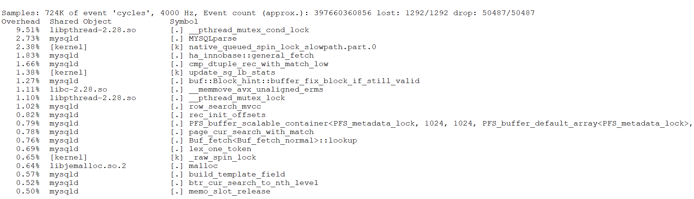
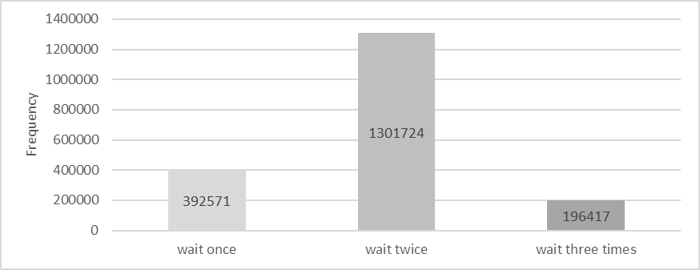
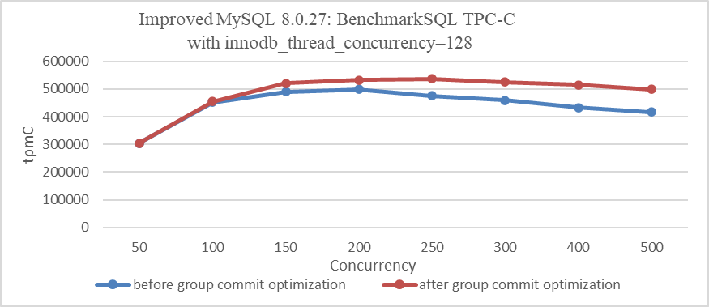
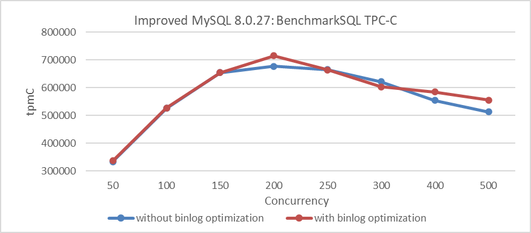
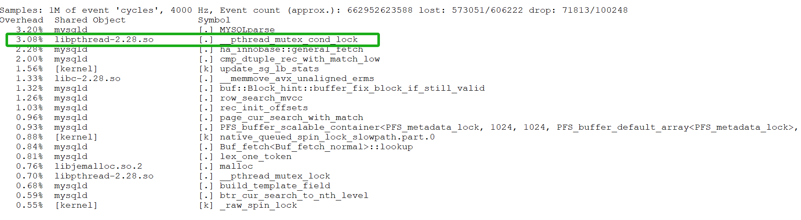

# Improving Binlog Group Commit Scalability

The binlog group commit mechanism is quite complex, and this complexity makes it challenging to identify its inherent performance problems.

First, capture performance problems during the TPC-C test with 500 concurrency using the *perf* tool, as shown in the following figure:



Figure 1. *_pthread_mutex_cond_lock* bottleneck reveals performance problems.

It is evident that *_pthread_mutex_cond_lock* is a significant bottleneck, accounting for approximately 9.5% of the overhead. Although *perf* does not directly pinpoint the exact problem, it indicates the presence of this bottleneck.

To address the problem, an in-depth exploration of MySQL internals was conducted to uncover the factors contributing to this performance bottleneck. A conventional binary search approach with minimal logging was used to identify functions or code segments that incur significant overhead during execution. The minimal logging approach was chosen to reduce performance interference while diagnosing the root cause of the problem. Excessive logging can disrupt performance analysis, and while some may use MySQL's internal mechanisms for troubleshooting, these often introduce substantial performance overhead themselves.

After thorough investigation, the bottleneck was identified within the following code segment.

```c++
  /*
    If the queue was not empty, we're a follower and wait for the
    leader to process the queue. If we were holding a mutex, we have
    to release it before going to sleep.
  */
  if (!leader) {
    CONDITIONAL_SYNC_POINT_FOR_TIMESTAMP("before_follower_wait");
    mysql_mutex_lock(&m_lock_done);
    ... 
    ulonglong start_wait_time = my_micro_time();
    while (thd->tx_commit_pending) {
      if (stage == COMMIT_ORDER_FLUSH_STAGE) {
        mysql_cond_wait(&m_stage_cond_commit_order, &m_lock_done);
      } else {
        mysql_cond_wait(&m_stage_cond_binlog, &m_lock_done);
      }
    }
    ulonglong end_wait_time = my_micro_time();
    ulonglong wait_time = end_wait_time - start_wait_time;
    if (wait_time > 100000) {
        fprintf(stderr, "wait too long:%llu\n", wait_time);
    }
    mysql_mutex_unlock(&m_lock_done);
    return false;
  }
```

Numerous occurrences of 'wait too long' output indicate that the bottleneck has been exposed. To investigate why 'wait too long' is being reported, the logs were added and modified accordingly. See the specific code below:

```c++
 /*
    If the queue was not empty, we're a follower and wait for the
    leader to process the queue. If we were holding a mutex, we have
    to release it before going to sleep.
  */
  if (!leader) {
    CONDITIONAL_SYNC_POINT_FOR_TIMESTAMP("before_follower_wait");
    mysql_mutex_lock(&m_lock_done);
    ...
    ulonglong start_wait_time = my_micro_time();
    while (thd->tx_commit_pending) {
      if (stage == COMMIT_ORDER_FLUSH_STAGE) {
        mysql_cond_wait(&m_stage_cond_commit_order, &m_lock_done);
      } else {
        mysql_cond_wait(&m_stage_cond_binlog, &m_lock_done);
      }
      fprintf(stderr, "wake up thread:%p,total wait time:%llu, stage:%d\n",
              thd, my_micro_time() - start_wait_time, stage);
    }
    ulonglong end_wait_time = my_micro_time();
    ulonglong wait_time = end_wait_time - start_wait_time;
    if (wait_time > 100000) {
        fprintf(stderr, "wait too long:%llu for thread:%p\n", wait_time, thd);
    }
    mysql_mutex_unlock(&m_lock_done);
    return false;
  }
```

 After another round of testing, a peculiar phenomenon was observed: when 'wait too long' messages appeared, the 'wake up thread' logs showed that many user threads were awakened multiple times.

The problem was traced to the *thd->tx_commit_pending* value not changing, causing threads to repeatedly re-enter the wait process. Further inspection reveals the conditions under which this variable becomes false, as illustrated in the following code:

```c++
void Commit_stage_manager::signal_done(THD *queue, StageID stage) {
  mysql_mutex_lock(&m_lock_done);
  for (THD *thd = queue; thd; thd = thd->next_to_commit) {
    thd->tx_commit_pending = false;
    thd->rpl_thd_ctx.binlog_group_commit_ctx().reset();
  }
  /* if thread belong to commit order wake only commit order queue threads */
  if (stage == COMMIT_ORDER_FLUSH_STAGE)
    mysql_cond_broadcast(&m_stage_cond_commit_order);
  else
    mysql_cond_broadcast(&m_stage_cond_binlog);
  mysql_mutex_unlock(&m_lock_done);
}
```

From the code, it is evident that *thd->tx_commit_pending* is set to false in the *signal_done* function. The *mysql_cond_broadcast* function then activates all waiting threads, leading to a situation similar to a thundering herd problem. When all previously waiting user threads are activated, they check if tx_commit_pending has been set to false. If it has, they proceed with processing; otherwise, they continue waiting.

Despite the complexity of the binlog group commit mechanism, a straightforward analysis identifies the root cause: threads that should not be activated are being triggered, leading to unnecessary context switches with each activation.

During one test, additional statistics were collected on the number of times user threads entered the wait state. The details are shown in the following figure:



Figure 2. Statistics of threads activated 1, 2, 3 times.

Waiting once is normal and indicates 100% efficiency. Waiting twice suggests 50% efficiency, and waiting three times indicates 33.3% efficiency. Based on the figure, the overall activation efficiency is calculated to be 52.7%.

To solve this problem, an ideal solution would be a multicast activation mechanism with 100% efficiency, where user threads with tx_commit_pending set to false are activated together. However, implementing this requires a deep understanding of the complex logic behind binlog group commit.

In this case, a point-to-point activation mechanism is used, achieving 100% efficiency but introducing significant system call overhead. The following figure illustrates the relationship between TPC-C throughput and concurrency before and after optimization.



Figure 3. Impact of group commit optimization with innodb_thread_concurrency=128.

From the figure, it is evident that with innodb_thread_concurrency=128, the optimization of binlog group commit significantly improves throughput under high concurrency.

It's important to note that this optimization's effectiveness can vary depending on factors such as configuration settings and specific scenarios. However, overall, it notably improves throughput, especially in high concurrency conditions.

Below is the comparison of TPC-C throughput and concurrency before and after optimization using standard configurations:



Figure 4. Impact of group commit optimization using standard configurations.

From the figure, it is clear that this optimization is less pronounced compared to the previous one, but it still shows overall improvement. Extensive testing indicates that the worse the scalability of MySQL, the more significant the effectiveness of binlog group commit optimization.

At the same time, the previously identified bottleneck of *_pthread_mutex_cond_lock* has been significantly alleviated after optimization, as shown in the following figure:



Figure 5. Mitigation of *_pthread_mutex_cond_lock* bottleneck.

In summary, this optimization helps address scalability problems associated with binlog group commit.

## References：

[1] Bin Wang (2024). The Art of Problem-Solving in Software Engineering:How to Make MySQL Better.