# Evaluating Performance Gains in MySQL Lock Scheduling Algorithms

Scheduling is crucial in computer system design. The right policy can significantly reduce mean response time without needing faster machines, effectively improving performance for free. Scheduling also optimizes other metrics, such as user fairness and differentiated service levels, ensuring some job classes have lower mean delays than others [1].

MySQL 8.0 uses the Contention-Aware Transaction Scheduling (CATS) algorithm to prioritize transactions waiting for locks. When multiple transactions compete for the same lock, CATS determines the priority based on scheduling weight, calculated by the number of transactions a given transaction blocks. The transaction blocking the most others gets higher priority; if weights are equal, the longest waiting transaction goes first.

A deadlock occurs when multiple transactions cannot proceed because each holds a lock needed by another, causing all involved to wait indefinitely without releasing their locks.

After understanding the MySQL lock scheduling algorithm, let's examine how this algorithm affects throughput. Before testing, it is necessary to understand the previous FIFO algorithm and how to restore it. For relevant details, refer to the git log explanations provided below.

```c++
This WL improves the implementation of CATS to the point where the FCFS will be redundant (as often slower, and easy to "emulate" by setting equal schedule weights in CATS), so it removes FCFS from the code, further simplifying the lock_sys's logic.
```

Based on the above prompt, restoring the FIFO lock scheduling algorithm in MySQL is straightforward. Subsequently, throughput was tested using SysBench Pareto distribution scenarios with varying concurrency levels in the improved MySQL 8.0.32. Details are provided in the following figure.

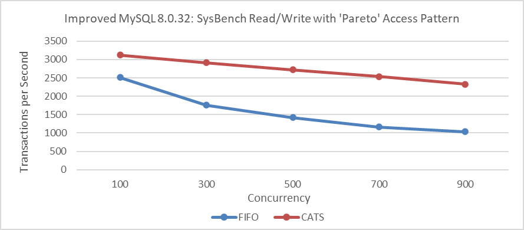

Figure 1. Impact of CATS on throughput at various concurrency levels.

From the figure, it can be seen that the throughput of the CATS algorithm significantly exceeds that of the FIFO algorithm. To compare these two algorithms in terms of user response time, refer to the following figure.

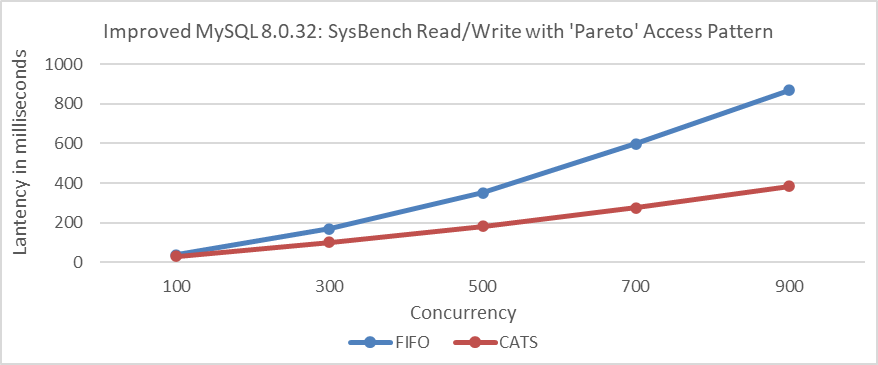

Figure 2. Impact of CATS on response time at various concurrency levels.

From the figure, it can be seen that the CATS algorithm provides significantly better user response times.

Furthermore, comparing deadlock error statistics during the Pareto distribution test process, details can be found in the following figure.

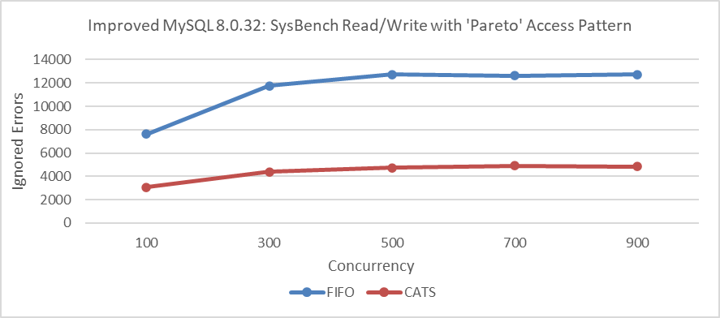

Figure 3. Impact of CATS on ignored errors at various concurrency levels.

Comparative analysis shows that the CATS algorithm significantly reduces deadlocks. This reduction in deadlocks likely plays a key role in improving performance. The theoretical basis for this correlation is as follows [2]:

*Under a high-contention setting, the throughput of the target system will be determined by the concurrency control mechanism of the target system: systems which can release locks earlier or reduce the number of aborts will have advantages in such a setting.*

The above test results align closely with MySQL's official findings. The following two figures, based on official tests [3], demonstrate the significant effectiveness of the CATS algorithm.

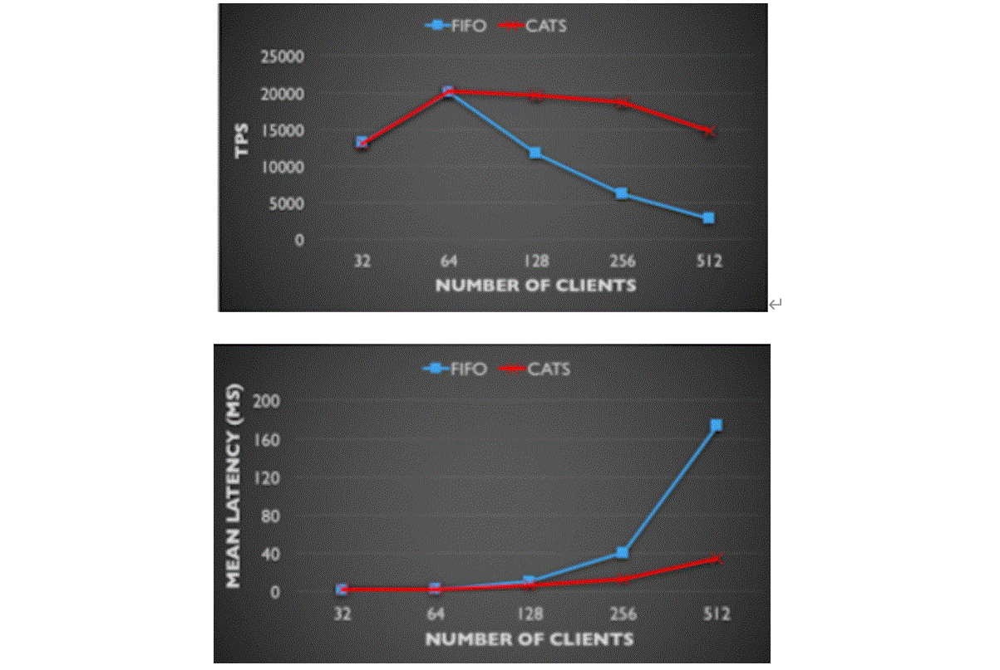

Figure 4. Comparison of CATS and FIFO in TPS and mean latency: insights from the MySQL blog.

Additionally, MySQL's official requirements for implementing the CATS algorithm are stringent. Specific details are provided in the following figure:

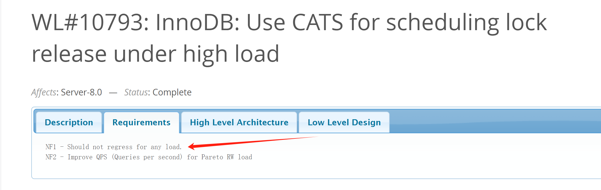

Figure 5. Requirements of the official worklog for CATS.

Therefore, with the adoption of the CATS algorithm, performance degradation should be absent in all scenarios. It seems like things end here, but the summary in the CATS algorithm's paper [1] raises some doubts. Details are provided in the following figure:

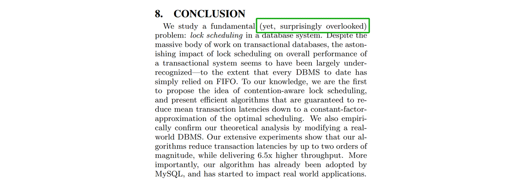

Figure 6. Doubts about the CATS paper.

From the information above, it can be inferred that either the industry has overlooked potential flaws in FIFO, or the paper's assessment is flawed, and FIFO does not have the serious problems suggested. This contradiction highlights a critical problem: one of these conclusions must be flawed; both cannot be correct.

Contradictions often present valuable opportunities for in-depth problem analysis and resolution. They highlight areas where existing understanding may be challenged or where new insights can be gained.

This time, testing on the improved MySQL 8.0.27 revealed significant bottlenecks under severe conflicts. The *perf* screenshot is shown in the following figure:

This time, testing on the improved MySQL 8.0.27 revealed a large number of error logs in the MySQL error log file. Below is a partial screenshot:

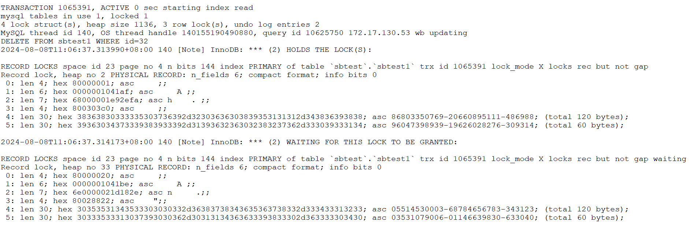

Figure 7. Partial screenshot of numerous error logs.

Continuing the analysis of the corresponding code, the specifics are as follows:

```c++
void Deadlock_notifier::notify(const ut::vector<const trx_t *> &trxs_on_cycle,
                               const trx_t *victim_trx) {
  ut_ad(locksys::owns_exclusive_global_latch());
  start_print();
  const auto n = trxs_on_cycle.size();
  for (size_t i = 0; i < n; ++i) {
    const trx_t *trx = trxs_on_cycle[i];
    const trx_t *blocked_trx = trxs_on_cycle[0 < i ? i - 1 : n - 1];
    const lock_t *blocking_lock =
        lock_has_to_wait_in_queue(blocked_trx->lock.wait_lock, trx);
    ut_a(blocking_lock);
    print_title(i, "TRANSACTION");
    print(trx, 3000);
    print_title(i, "HOLDS THE LOCK(S)");
    print(blocking_lock);
    print_title(i, "WAITING FOR THIS LOCK TO BE GRANTED");
    print(trx->lock.wait_lock);
  }
  const auto victim_it =
      std::find(trxs_on_cycle.begin(), trxs_on_cycle.end(), victim_trx);
  ut_ad(victim_it != trxs_on_cycle.end());
  const auto victim_pos = std::distance(trxs_on_cycle.begin(), victim_it);
  ut::ostringstream buff;
  buff << "*** WE ROLL BACK TRANSACTION (" << (victim_pos + 1) << ")\n";
  print(buff.str().c_str());
  DBUG_PRINT("ib_lock", ("deadlock detected"));
  ...
  lock_deadlock_found = true;
}
```

From the code analysis, it's clear that deadlocks lead to a substantial amount of log output. The ignored errors observed during testing are connected to these deadlocks. The CATS algorithm helps reduce the number of ignored errors, resulting in fewer log outputs. This problem can be consistently reproduced.

Given this context, several considerations emerge:

1. **Impact on Performance Testing:** The extensive error logs and the resulting disruptions could potentially skew the performance evaluation, leading to inaccurate assessments of the system's capabilities.
2. **Effectiveness of the CATS Algorithm:** The performance improvement of the CATS algorithm may need re-evaluation. If the extensive output of error logs significantly impacts performance, its actual effectiveness may not be as high as initially believed.

Set `innodb_print_all_deadlocks=OFF` or remove all logging from the `Deadlock_notifier::notify` function, recompile MySQL, and run SysBench read-write tests with a Pareto distribution. Details are provided in the following figure:

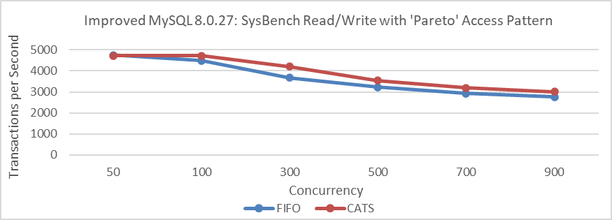

Figure 8. Impact of CATS on throughput at various concurrency levels for improved MySQL 8.0.27 after eliminating interference.

From the figure, it is evident that there has been a significant change in throughput comparison. In scenarios with severe conflicts, the CATS algorithm slightly outperforms the FIFO algorithm, but the difference is minimal and much less pronounced than in previous tests. Note that these tests were conducted on the improved MySQL 8.0.27.

Let's conduct performance comparison tests on the improved MySQL 8.0.32, with deadlock log interference removed, using Pareto distribution.

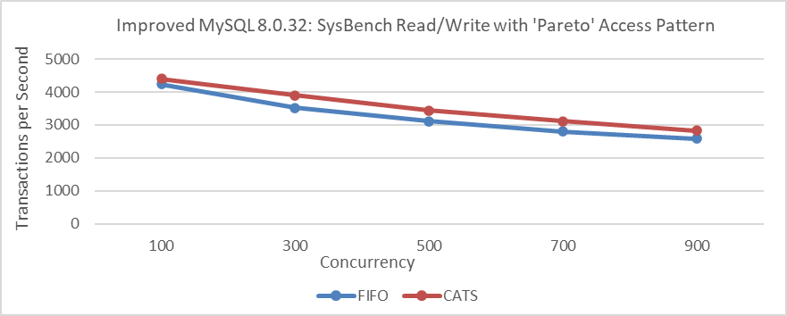

Figure 9. Impact of CATS on throughput at various concurrency levels for improved MySQL 8.0.32 after eliminating interference.

From the figure, it is evident that removing the interference results in only a slight performance difference. This small variation makes it understandable why the severity of FIFO scheduling problems may be difficult to notice. The perceived bias from the CATS author and MySQL officials is likely due to interference from extensive deadlock log output.

Using the same 32 warehouses as in the CATS algorithm paper, TPC-C tests were conducted at various concurrency levels. MySQL was based on the improved MySQL 8.0.27, and BenchmarkSQL was modified to support 100 concurrent transactions per warehouse.

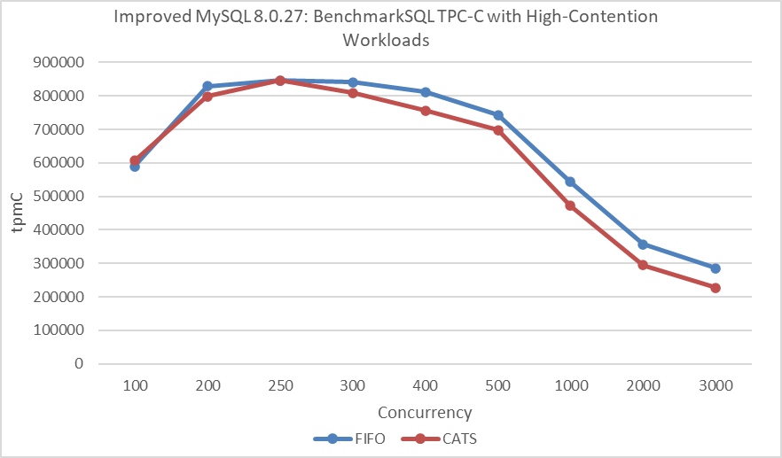

Figure 10. Impact of CATS on throughput at different concurrency levels under NUMA after eliminating interference, according to the CATS paper.

From the figure, it's evident that the CATS algorithm performs worse than the FIFO algorithm. To avoid NUMA-related interference, MySQL was bound to NUMA node 0 for a new round of throughput versus concurrency tests.

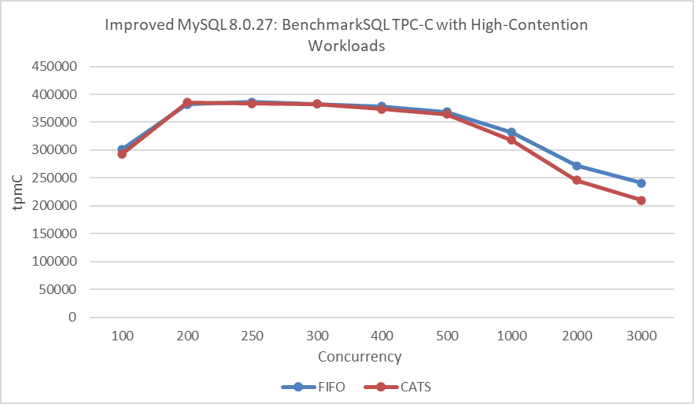

Figure 11. Impact of CATS on throughput at different concurrency levels under SMP after eliminating interference, according to the CATS paper.

In this round of testing, the FIFO algorithm continued to outperform the CATS algorithm. The decline in performance of the CATS algorithm in BenchmarkSQL TPC-C testing compared to improvements in SysBench Pareto testing can be attributed to the following reasons:

1. **Additional Overhead**: The CATS algorithm inherently introduces some extra overhead.
2. **NUMA Environment Problems**: The CATS algorithm may not perform optimally in NUMA environments.
3. **Conflict Severity**: The conflict severity in TPC-C testing is less pronounced than in SysBench Pareto testing.
4. **Different Concurrency Scenarios**: SysBench creates concurrency scenarios that differ significantly from those in BenchmarkSQL.

Finally, standard TPC-C testing was performed again with 1000 warehouses at varying concurrency levels. Specific details are shown in the following figure:

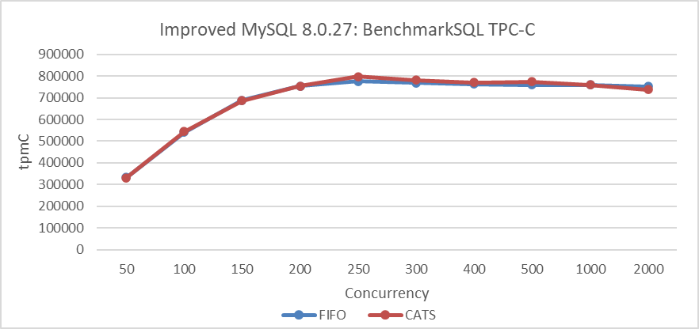

Figure 12. Impact of CATS on BenchmarkSQL throughput after eliminating interference.

From the figure, it is evident that there is little difference between the two algorithms in low-conflict scenarios. In other words, the CATS algorithm does not offer significant benefits in situations with fewer conflicts.

Overall, while CATS shows some improvement in Pareto testing, it is less pronounced than expected. The CATS algorithm significantly reduces transaction deadlocks, potentially resulting in less performance degradation than the FIFO algorithm. When deadlock logs are suppressed, the difference between these algorithms is minimal, clarifying the confusion surrounding the CATS algorithm's performance [4].

Database performance testing is inherently complex and error-prone [5]. It cannot be judged by data alone and requires thorough investigation to ensure logical consistency.

## References

[1] B. Tian, J. Huang, B. Mozafari, and G. Schoenebeck. Contention-aware lock scheduling for transactional databases. PVLDB, 11(5), 2018.

[2] Y. Wang, M. Yu, Y. Hui, F. Zhou, Y. Huang, R. Zhu, et al.. 2022. A study of database performance sensitivity to experiment settings, Proceedings of the VLDB Endowment, vol. 15, no. 7.

[3] Sunny Bains. 2017. Contention-Aware Transaction Scheduling Arriving in InnoDB to Boost Performance. https://dev.mysql.com/blog-archive/.

[4] Bin Wang (2024). The Art of Problem-Solving in Software Engineering:How to Make MySQL Better.

[5] M. Raasveldt, P. Holanda, T. Gubner, and H. Muhleisen. Fair Benchmarking Considered Difficult: Common Pitfalls In Database Performance Testing. In 7th International Workshop on Testing Database Systems, DBTest, 2:1--2:6, 2018.