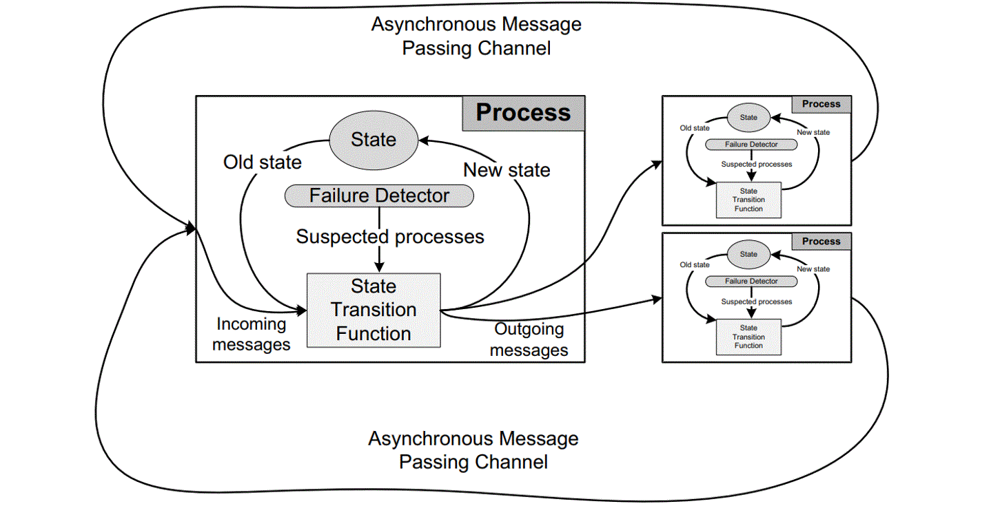
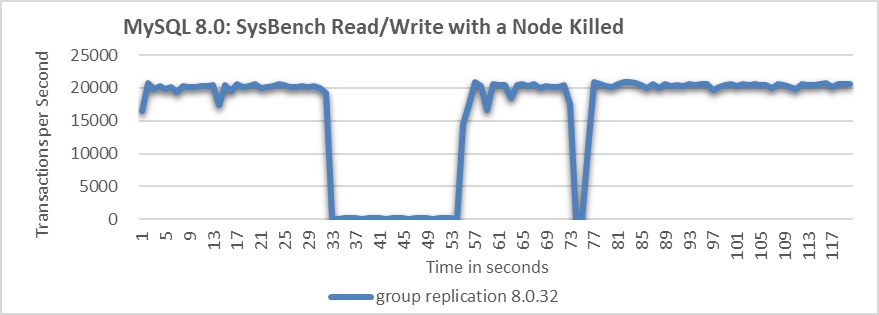
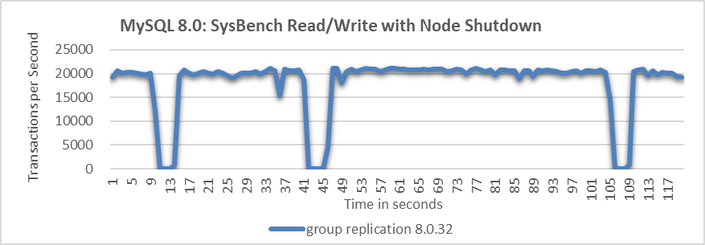
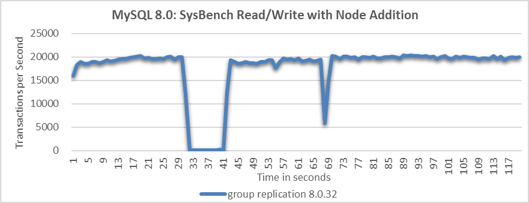
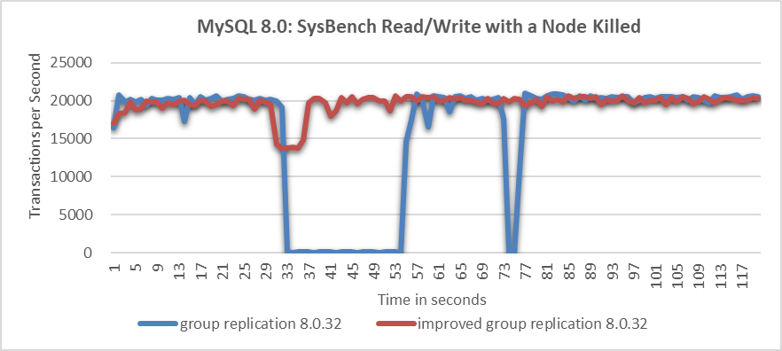
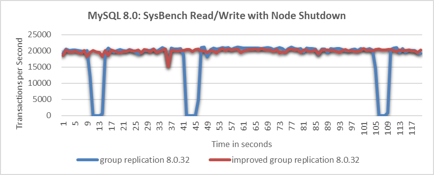
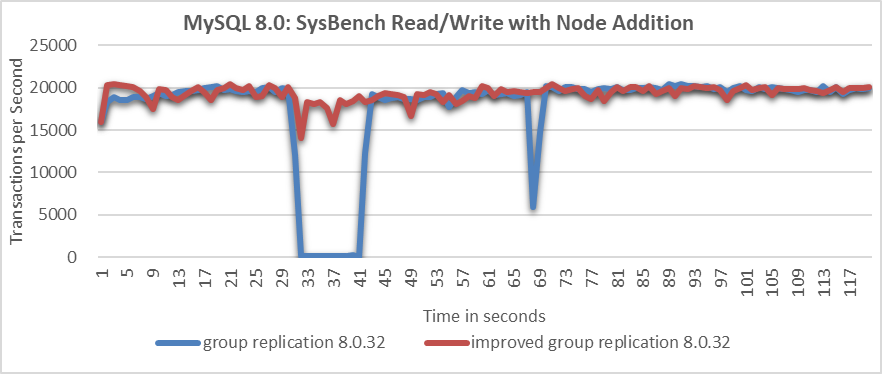

# How to Mitigate Performance Fluctuations in MySQL Group Replication Under Abnormal Conditions?

## 1.1 Enhancing the Fail Detection Mechanism

Accurately detecting node failure is challenging due to the FLP impossibility result, which states that consensus is impossible in a purely asynchronous system if even one process can fail. The difficulty arises because a server can't distinguish if another server has failed or is just "very slow" when it receives no messages [1]. Fortunately, most practical systems are not purely asynchronous, so the FLP result doesn't apply. To circumvent this, additional assumptions about system synchrony are made, allowing for the design of protocols that maintain safety and provide liveness under certain conditions. One common method is to use an inaccurate local failure detector.



Figure 1. The asynchronous message passing model borrowed from the Mencius paper.

The figure above illustrates the asynchronous message passing model. Each failure detector monitors servers and maintains a list of suspected faulty servers. These detectors can make mistakes, such as suspecting a running server has crashed. If later corrected, the server can be removed from the suspected list. Protocols using failure detectors must always ensure safety despite these errors and guarantee progress when the detectors remain accurate for long periods.

Group Replication's failure detection mechanism identifies and expels non-communicating members. This increases the likelihood of the group containing a majority of functioning members, ensuring correct client request processing. All group members regularly exchange messages. If a member doesn't receive messages from another for 5 seconds, it suspects that member. If suspicion is not solved, the member is expelled. The expelled member remains unaware of its status and sees other members as unreachable. If it reconnects, it learns of its expulsion through an updated membership view.

After understanding the above content, let's analyze common types of view change events:

1. **Node is Killed**

   In a Linux system, when a node is killed, the TCP layer typically sends a reset (RST) packet to notify other nodes of the connection problem. Paxos communication can use this RST packet to identify the node's termination. However, MySQL does not handle this specifically and relies on the standard timeout mechanism.

2. **Node is Network-Partitioned**

   Detecting whether a node is network-partitioned or simply slow is challenging. In such cases, timeout mechanisms are used, as it is difficult to definitively distinguish between these situations.

3. **Node is Gracefully Taken Offline**

   Normally, informing other nodes by sending a command should be straightforward. However, MySQL has not managed this aspect well.

4. **Adding a new node to the cluster**

   Adding a new node requires consensus and involves a final installation view synchronization. Although some performance fluctuations are expected, severe fluctuations indicate poor handling of the node addition process.

Whenever a change that needs replication occurs, the group must achieve consensus. This applies to regular transactions, group membership changes, and certain internal messaging to maintain group consistency. Consensus requires a majority of group members to agree on a decision. Without a majority, the group cannot progress and blocks because it cannot secure a quorum.

Quorum may be lost due to multiple involuntary failures, causing a majority of servers to be abruptly removed. In a group of 5 servers, if 3 servers become unresponsive simultaneously, the majority is lost, which prevents reaching quorum.

Conversely, if servers exit the group voluntarily, they can instruct the group to reconfigure itself. A server leaving the group notifies others, allowing proper reconfiguration. This maintains membership consistency and recalculates the majority. For example, if 3 out of 5 servers leave one by one, informing the group, the membership can adjust from 5 to 2 while securing quorum during the process [2].

After understanding the working mechanism of view change, one can then examine how MySQL handles it.

In cases of node failure or network partitioning, MySQL's handling approach is similar. Testing was conducted with one MySQL secondary killed. Details of the test can be seen in the following figure.

  

Figure 2. Significant throughput fluctuations when a node is killed.

From the figure, it is evident that when the MySQL secondary is killed, the MySQL primary's throughput fluctuates significantly, with a drop to zero lasting over 20 seconds. Ideally, in a three-node cluster, if one node is killed, the remaining two nodes should still form a majority, preventing a prolonged zero-throughput problem. This suggests that MySQL may not effectively manage the majority quorum and fail detection mechanisms.

When a MySQL secondary is gracefully taken offline, the throughput typically behaves as follows:

 

Figure 3. Throughput drops to zero at intervals when a node is shut down.

The figure shows that allowing a MySQL node to be gracefully taken offline causes throughput to drop to zero at several points, indicating problems with the fail detection mechanism.

What will happen when adding a MySQL node in Group Replication?



Figure 4. Throughput drop of approximately 10 seconds when a node is added.

From the figure, it is evident that the node addition process resulted in a throughput drop of approximately 10 seconds. This indicates that MySQL did not handle the node addition process effectively.

To address these problems in Group Replication, improving the probing mechanism is crucial for enhancing fault detection accuracy. Without this improvement, throughput can be significantly disrupted, making further performance enhancements challenging.

Regarding the probe mechanism, the following improvements have been made.

1. **Ensure Fair Execution for Probe Coroutines**

   During the processing of large transactions, the Paxos protocol handles substantial writeset data, monopolizing the processing resources of the single-threaded coroutine model. This leaves limited opportunities for the probe detection coroutine to update critical information. As a result, outdated probe data can lead to incorrect judgments, as observed in section 1.2.5.

   To address this, the solution is to amortize data processing by splitting large transactions into multiple stages. This approach ensures that the probe detection coroutine gets more equitable opportunities to execute and update information promptly, enhancing the accuracy of fault detection.

2. **Improved Wakeup Delay Function**

   Check the **wakeup_delay** function in MySQL, as shown in the code below:

   ```c++
   static double wakeup_delay(double old) {
     double const minimum_threshold = 0.1;
   #ifdef EXECUTOR_TASK_AGGRESSIVE_NO_OP  
     double const maximum_threshold = 1.0;
   #else   
     double const maximum_threshold = 20.0;
   #endif /* EXECUTOR_TASK_AGGRESSIVE_NO_OP */
     double retval = 0.0;
     if (0.0 == old) {
       double m = median_time();
       double const fuzz = 5.0;
       IFDBG(D_BUG, FN; NDBG(m, f));
       // Guard against unreasonable estimates of median consensus time
       if (m <= 0.0) m = minimum_threshold;
       if (m > maximum_threshold / fuzz) m = (maximum_threshold / fuzz) / 2.0;
       retval = minimum_threshold + fuzz * m + m * xcom_drand48();
     } else {
       retval = old * 1.4142136; /* Exponential backoff */
     } 
     /* If we exceed maximum, choose a random value in the max/2..max interval */
     if (retval > maximum_threshold) {
       double const low = maximum_threshold / 2.0;
       retval = low + xcom_drand48() * (maximum_threshold - low);
     }
     IFDBG(D_BUG, FN; NDBG(retval, f));
     return retval;
   }
   ```

   From the code, it is evident that the calculated delay time is too rigid. This inflexibility is a key reason for performance fluctuations, as the primary may wait too long after a node exits. To address this, adjusting the relevant constants based on the environment is essential for adapting to complex and variable network conditions.

3. **Split the wakeup_delay function to adapt to different environments**

   For example, when checking if propose messages have been accepted, utilize the original *wakeup_delay* function, as shown in the code below:

   ```c++
         while (!finished(ep->p)) { /* Try to get a value accepted */
           /* We will wake up periodically, and whenever a message arrives */
           TIMED_TASK_WAIT(&ep->p->rv, ep->delay = wakeup_delay(ep->delay));
           ...
   ```

   In the function *get_xcom_message*, the *wakeup_delay_for_perf* function is used, as shown in the code below:

   ```c++
     DECL_ENV
     ...
     while (!finished(*p)) {
       ...
       if (!((*p)->force_delivery)) {
         ep->delay = wakeup_delay_for_perf(ep->delay, 0.003);
       } else {
         ep->delay = wakeup_delay_for_perf(ep->delay, 0.1);
       }
       IFDBG(D_NONE, FN; NDBG(ep->delay, f));
       TIMED_TASK_WAIT(&(*p)->rv, ep->delay);
       *p = get_cache(msgno);
       dump_debug_exec_state();
     }
     FINALLY
     IFDBG(D_NONE, FN; SYCEXP(msgno); PTREXP(*p); NDBG(ep->wait, u);
           SYCEXP(msgno));
     TASK_END;
   }
   ```

   In the *wakeup_delay_for_perf* function, a more aggressive strategy can be employed, such as reducing the waiting time further.

4. Incorporate the Round-trip time (RTT) from the network into the wakeup_delay.

   The purpose of this is to enhance the accuracy of network probing activities.

5. Distinguish between node being killed and network partition.

   In Linux systems, when a node is killed, TCP sends reset packets to the other nodes in the cluster, helping distinguish between node terminations and network partition faults. Integrating information about abnormal node terminations into Paxos' decision-making logic allows for more accurate judgments, addressing the problem of prolonged throughput drops experienced during abrupt node terminations.

With the implementation of the above mechanism, probing accuracy has been significantly enhanced. Combined with the forthcoming degradation mechanism, this ensures relatively stable throughput even under abnormal conditions.

## 1.2 Leverage the Degradation Mechanism to Address Prolonged Waiting Problems

The degradation mechanism employs a majority-based approach to make decisions when a node becomes unresponsive after a short delay. While this mechanism is not new and is already part of Mencius interaction, MySQL has not effectively leveraged it to handle exceptional situations.

One drawback of the degradation mechanism is that it increases network interactions, including the prepare phase, leading to a performance decrease. However, its advantage lies in significantly improving throughput compared to how MySQL handles faults. In theory, as long as network latency between majority nodes is low, the degradation mechanism can be highly effective.

The following figure compares the throughput of SysBench read-write tests before and after improvements, following node being killed.



Figure 5. Significant throughput improvement observed when a node is killed.

From the figure, it's evident that the native Group Replication experiences prolonged throughput drops, which are unacceptable to users. In the improved Group Replication, throughput decreases from 20,000 to 14,000 transactions per second due to the degradation process. Although this decrease is noticeable, users consider it acceptable as it represents a significant improvement over the native Group Replication.

Let's continue to examine the throughput comparison over time before and after improvements following the normal shutdown of a particular node, as shown in the following figure:



Figure 6. Significant throughput improvement observed when a node is closed.

From the figure, it's clear that the improved Group Replication provides much more stable throughput compared to the native version. Although minor fluctuations occur during view changes due to internal synchronization, the improved Group Replication's throughput performance is deemed acceptable by users. In contrast, the frequent throughput drops in the native Group Replication are considered unacceptable.

Once again, comparing the throughput over time before and after improvements in the scenario of adding a MySQL secondary to the cluster, as shown in the following figure:



Figure 7. Significant throughput improvement observed when adding a node to cluster.

From the figure, it is evident that the native Group Replication experiences throughput drops of around 10 seconds, whereas the improved Group Replication shows only a slight decrease in throughput with minimal impact on performance.

Overall, the problems with native Group Replication in abnormal scenarios can be effectively solved [3].

## References：

[1] Y. Mao, F. P. Junqueira, and K. Marzullo. Mencius: building efficient replicated state machines for WANs. In Proc. 8th USENIX OSDI, pages 369--384, San Diego, CA, Dec. 2008.

[2] https://dev.mysql.com/doc/refman/8.0/en/.

[3] Bin Wang (2024). The Art of Problem-Solving in Software Engineering:How to Make MySQL Better.

