## Enhancing the InnoDB Storage Engine

### 1.1 MVCC ReadView: Identified Problems

A key component of any MVCC scheme is the mechanism for quickly determining which tuples are visible to which transactions. A transaction's snapshot is created by building a ReadView (RV) vector that holds the TXIDs of all concurrent transactions smaller than the transaction's TXID. The cost of acquiring a snapshot increases linearly with the number of concurrent transactions, even if the transaction only reads tuples written by a single committed transaction, highlighting a known scalability limitation [1].

After understanding the scalability problems with the MVCC ReadView mechanism, let's examine how MySQL implements MVCC ReadView. Under the Read Committed isolation level, during the process of reading data, the InnoDB storage engine triggers the acquisition of the ReadView. A screenshot of part of the ReadView data structure is shown below:

```c++
private:
  // Disable copying
  ReadView(const ReadView &);
  ReadView &operator=(const ReadView &);
private:
  /** The read should not see any transaction with trx id >= this
  value. In other words, this is the "high water mark". */
  trx_id_t m_low_limit_id;
  /** The read should see all trx ids which are strictly
  smaller (<) than this value.  In other words, this is the
  low water mark". */
  trx_id_t m_up_limit_id;
  /** trx id of creating transaction, set to TRX_ID_MAX for free
  views. */
  trx_id_t m_creator_trx_id;
  /** Set of RW transactions that was active when this snapshot
  was taken */
  ids_t m_ids;
  /** The view does not need to see the undo logs for transactions
  whose transaction number is strictly smaller (<) than this value:
  they can be removed in purge if not needed by other views */
  trx_id_t m_low_limit_no;
  ...
```

Here, *m_ids* is a data structure of type *ids_t*, which closely resembles *std::vector*. See the specific explanation below:

```c++
  /** This is similar to a std::vector but it is not a drop
  in replacement. It is specific to ReadView. */
  class ids_t {
    typedef trx_ids_t::value_type;
    /**
    Constructor */
    ids_t() : m_ptr(), m_size(), m_reserved() {}
    /**
    Destructor */
    ~ids_t() { ut::delete_arr(m_ptr); }
    /** Try and increase the size of the array. Old elements are copied across.
    It is a no-op if n is < current size.
    @param n            Make space for n elements */
    void reserve(ulint n);
    ...
```

Algorithm for MVCC ReadView visibility determination, specifically refer to the *changes_visible* function below:

```c++
  /** Check whether the changes by id are visible.
  @param[in]    id      transaction id to check against the view
  @param[in]    name    table name
  @return whether the view sees the modifications of id. */
  [[nodiscard]] bool changes_visible(trx_id_t id,
                                     const table_name_t &name) const {
    ut_ad(id > 0);
    if (id < m_up_limit_id || id == m_creator_trx_id) {
      return (true);
    }
    check_trx_id_sanity(id, name);
    if (id >= m_low_limit_id) {
      return (false);
    } else if (m_ids.empty()) {
      return (true);
    }
    const ids_t::value_type *p = m_ids.data();
    return (!std::binary_search(p, p + m_ids.size(), id));
 }
```

From the code, it can be seen that the visibility algorithm works efficiently when concurrency is low. However, as concurrency increases, the efficiency of using binary search to determine visibility significantly decreases, particularly in NUMA environments.

### 1.2 Solutions for Enhancing MVCC ReadView Scalability

There are two fundamental approaches to improving scalability here [2]:

*First, finding an algorithm that improves the complexity, so that each additional connection does not increase the snapshot computation costs linearly.*

*Second, perform less work for each connection, hopefully reducing the total time taken so much that even at high connection counts the total time is still small enough to not matter much (i.e. reduce the constant factor).*

For the first solution, adopting a multi-version visibility algorithm based on Commit Sequence Numbers (CSN) offers benefits [7]: *the cost of taking snapshots can be reduced by converting snapshots into CSNs instead of maintaining a transaction ID list.* Specifically, under the Read Committed isolation level, there's no need to replicate an active transaction list for each read operation, thereby improving scalability.

Considering the complexity of implementation, this book opts for the second solution, which directly modifies the MVCC ReadView data structure to mitigate MVCC ReadView scalability problems.

### 1.3 Improvements to the MVCC ReadView Data Structure

In the ReadView structure, the original approach used a vector to store the list of active transactions. Now, it has been changed to the following data structure:

```c++
class ReadView {
 ...
 private:
  // Disable copying
  ReadView &operator=(const ReadView &);
 public:
  bool skip_view_list{false};
 private:
  unsigned char top_active[MAX_TOP_ACTIVE_BYTES];
  trx_id_t m_short_min_id;
  trx_id_t m_short_max_id;
  bool m_has_short_actives;
  /** The read should not see any transaction with trx id >= this
  value. In other words, this is the "high water mark". */
  trx_id_t m_low_limit_id;
  /** The read should see all trx ids which are strictly
  smaller (<) than this value.  In other words, this is the low water mark". */
  trx_id_t m_up_limit_id;
  /** trx id of creating transaction, set to TRX_ID_MAX for free views. */
  trx_id_t m_creator_trx_id;
  /** Set of RW transactions that was active when this snapshot
  was taken */
  ids_t m_long_ids;
  ...
```

Furthermore, corresponding code modifications were made in the related interface functions, as changes to the data structure necessitate adjustments to the internal code within these functions.

This new MVCC ReadView data structure can be seen as a hybrid data structure, as shown in the following figure  [3].

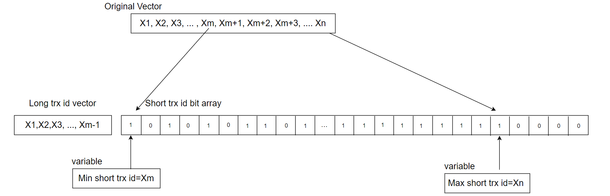

Figure 1. A new hybrid data structure suitable for active transaction list in MVCC ReadView.

Typically, online transactions are short rather than long, and transaction IDs increase continuously. To leverage these characteristics, a hybrid data structure is used: a static array for consecutive short transaction IDs and a vector for long transactions. With a 2048-byte array, up to 16,384 consecutive active transaction IDs can be stored, each bit representing a transaction ID.

The minimum short transaction ID is used to differentiate between short and long transactions. IDs smaller than this minimum go into the long transaction vector, while IDs equal to or greater than it are placed in the short transaction array. For an ID in changes_visible, if it is below the minimum short transaction ID, a direct query is made to the vector, which is efficient due to the generally small number of long transactions. If the ID is equal to or above the minimum short transaction ID, a bitwise query is performed, with a time complexity of O(1), compared to the previous O(log n) complexity. This improvement enhances efficiency and reduces cache migration between NUMA nodes, as O(1) queries typically complete within a single CPU time slice.

In addition to the previously mentioned transformation, similar modifications were applied to the global transaction active list. The original data structure used for this list is shown in the following code snippet:

```c++
  /** Array of Read write transaction IDs for MVCC snapshot. A ReadView would
  take a snapshot of these transactions whose changes are not visible to it.
  We should remove transactions from the list before committing in memory and
  releasing locks to ensure right order of removal and consistent snapshot. */
  trx_ids_t rw_trx_ids;
```

Now it has been changed to the following data structure:

```c++
  /** Array of Read write transaction IDs for MVCC snapshot. A ReadView would
  take a snapshot of these transactions whose changes are not visible to it.
  We should remove transactions from the list before committing in memory and
  releasing locks to ensure right order of removal and consistent snapshot. */
  trx_ids_t long_rw_trx_ids;
  unsigned char short_rw_trx_ids_bitmap[MAX_SHORT_ACTIVE_BYTES];
  int short_rw_trx_valid_number;
  trx_id_t min_short_valid_id;
  trx_id_t max_short_valid_id
```

In the *short_rw_trx_ids_bitmap* structure, *MAX_SHORT_ACTIVE_BYTES* is set to 65536, theoretically accommodating up to 524,288 consecutive short transaction IDs. If the limit is exceeded, the oldest short transaction IDs are converted into long transactions and stored in *long_rw_trx_ids*. Global long and short transactions are distinguished by *min_short_valid_id*: IDs smaller than this value are treated as global long transactions, while IDs equal to or greater are considered global short transactions.

During the copying process from the global active transaction list, the *short_rw_trx_ids_bitmap* structure, which uses only one bit per transaction ID, allows for much higher copying efficiency compared to the native MySQL solution. For example, with 1000 active transactions, the native MySQL version would require copying at least 8000 bytes, whereas the optimized solution may only need a few hundred bytes. This results in a significant improvement in copying efficiency.

After implementing these modifications, performance comparison tests were conducted to evaluate the effectiveness of the MVCC ReadView optimization. The figure below shows a comparison of TPC-C throughput with varying concurrency levels, before and after modifying the MVCC ReadView data structure.

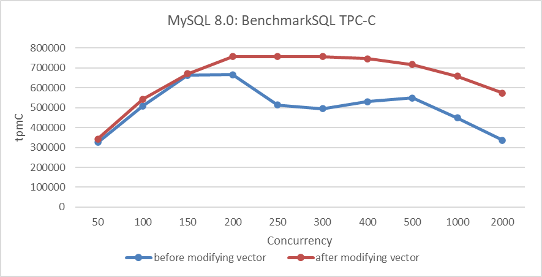

Figure 2. Performance comparison before and after adopting the new hybrid data structure in NUMA.

From the figure, it is evident that this transformation primarily optimized scalability and improved MySQL's peak throughput in NUMA environments. Further performance comparisons before and after optimization can be analyzed using tools like *perf*. Below is a screenshot from *perf* at 300 concurrency, prior to optimization:

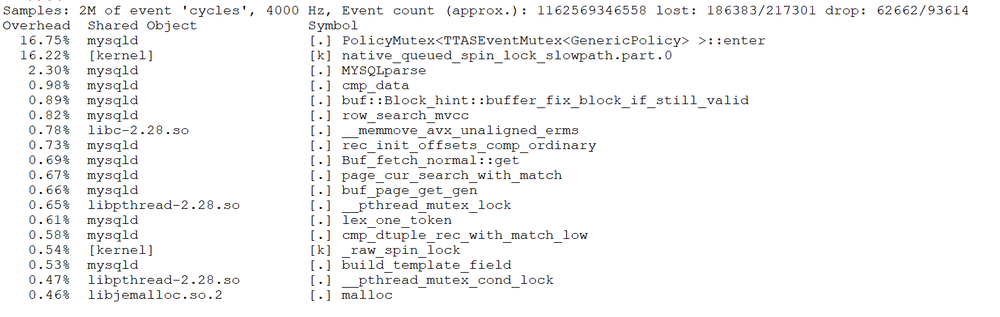

Figure 3. Latch-related bottleneck observed in *perf* screenshot.

From the figure, it can be seen that the first two bottlenecks were significant, accounting for approximately 33% of the overhead. After optimization, the *perf* screenshot at 300 concurrency is as follows:

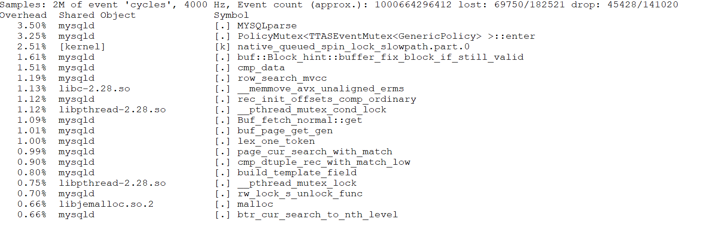

Figure 4. Significant alleviation of latch-related bottleneck.

After optimization, as shown in the screenshot above, the proportions of the previous top two bottlenecks have been significantly reduced.

Why does changing the MVCC ReadView data structure significantly enhance scalability? This is because accessing these structures involves acquiring a global latch. Optimizing the data structure accelerates access to critical resources, reducing concurrency conflicts and minimizing cache migration across NUMA nodes.

The native MVCC ReadView uses a vector to store the list of active transactions. In high-concurrency scenarios, this list can become large, leading to a larger working set. In NUMA environments, both querying and replication can become slower, potentially causing a single CPU time slice to miss its deadline and resulting in significant context-switching costs. The theoretical basis for this aspect is as follows [4]:

*Context-switches that occur in the middle of a logical operation evict a possibly larger working set from the cache. When the suspended thread resumes execution, it wastes time restoring the evicted working set.*

Throughput improvement under the ARM architecture is evaluated next. Details are shown in the following figure:

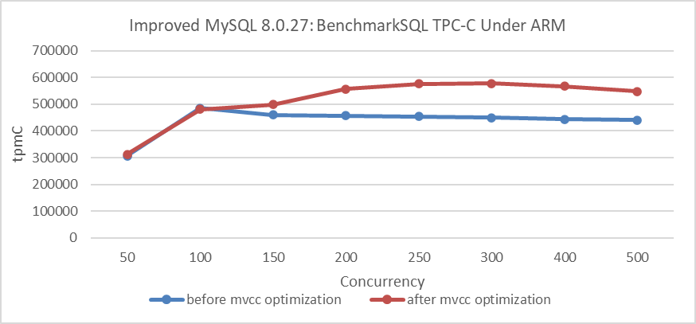

Figure 5. Throughput improvement under the ARM architecture.

From the figure, it is evident that there is also a significant improvement under the ARM architecture. Extensive test data confirms that the MVCC ReadView optimization yields clear benefits in NUMA environments, regardless of whether the architecture is ARM or x86.

How much improvement can this optimization achieve in a SMP environment?

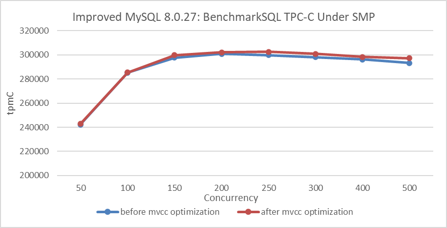

Figure 6. Performance comparison before and after adopting the new hybrid data structure in SMP.

From the figure, it can be observed that after binding to NUMA node 0, the improvement from the MVCC ReadView optimization is not significant. This suggests that the optimization primarily enhances scalability in NUMA architectures.

In practical MySQL usage, preventing excessive user threads from entering the InnoDB storage engine can significantly reduce the size of the global active transaction list. This transaction throttling mechanism complements the MVCC ReadView optimization effectively, improving overall performance. Combined with double latch avoidance, discussed in the next section, the TPC-C test results in the following figure clearly demonstrate these improvements.

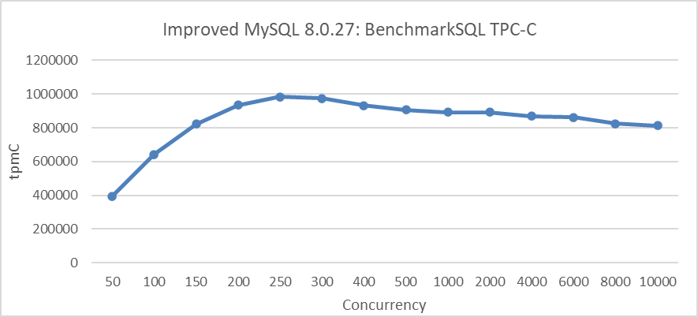

Figure 7. Maximum TPC-C throughput in BenchmarkSQL with transaction throttling mechanisms.

### 1.4 Avoiding Double Latch Problems

During testing after the MVCC ReadView optimization, a noticeable decline in throughput was observed under extremely high concurrency conditions. The specific details are shown in the following figure:

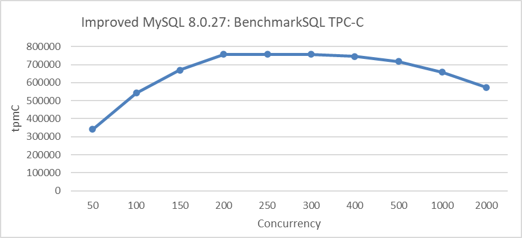

Figure 8. Performance degradation at concurrency Levels exceeding 500.

From the figure, it can be seen that throughput significantly decreases once concurrency exceeds 500. The problem was traced to frequent acquisitions of the *trx-sys* latch, as shown in the code snippet below:

```c++
    } else if (trx->isolation_level <= TRX_ISO_READ_COMMITTED &&
               MVCC::is_view_active(trx->read_view)) {
      mutex_enter(&trx_sys->mutex);
      trx_sys->mvcc->view_close(trx->read_view, true);
      mutex_exit(&trx_sys->mutex);
    }
```

The other code snippet is shown below:

```c++
  if (lock_type != TL_IGNORE && trx->n_mysql_tables_in_use == 0) {
    trx->isolation_level =
        innobase_trx_map_isolation_level(thd_get_trx_isolation(thd));
    if (trx->isolation_level <= TRX_ISO_READ_COMMITTED &&
        MVCC::is_view_active(trx->read_view)) {
      /* At low transaction isolation levels we let
      each consistent read set its own snapshot */
      mutex_enter(&trx_sys->mutex);
      trx_sys->mvcc->view_close(trx->read_view, true);
      mutex_exit(&trx_sys->mutex);
    }
  }
```

InnoDB introduces a global trx-sys latch during the view close process, impacting scalability under high concurrency. To address this, an attempt was made to remove the global latch. One of the modifications is shown in the code snippet below:

```c++
   } else if (trx->isolation_level <= TRX_ISO_READ_COMMITTED &&
               MVCC::is_view_active(trx->read_view)) {
      trx_sys->mvcc->view_close(trx->read_view, false);
}
```

The other modification is shown in the code snippet below:

```c++
  if (lock_type != TL_IGNORE && trx->n_mysql_tables_in_use == 0) {
    trx->isolation_level =
        innobase_trx_map_isolation_level(thd_get_trx_isolation(thd));
    if (trx->isolation_level <= TRX_ISO_READ_COMMITTED &&
        MVCC::is_view_active(trx->read_view)) {
      /* At low transaction isolation levels we let
      each consistent read set its own snapshot */
      trx_sys->mvcc->view_close(trx->read_view, false);
    }
  }
```

Using the MVCC ReadView optimized version, compare TPC-C throughput before and after the modifications. Details are shown in the following figure:

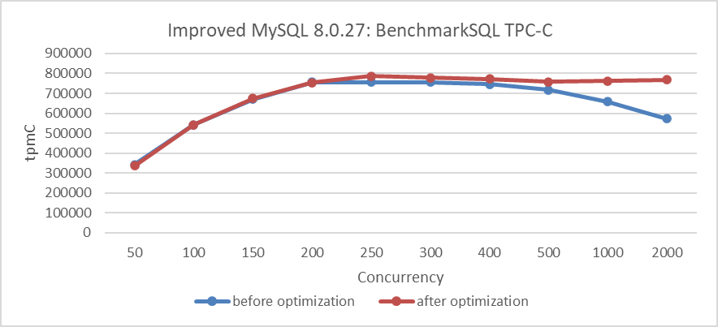

Figure 9. Performance improvement after eliminating the double latch bottleneck.

From the figure, it is evident that the modifications significantly improved scalability under high-concurrency conditions. To understand the reasons for this improvement, let's use the *perf* tool for further investigation. Below is the *perf* screenshot at 2000 concurrency before the modifications:

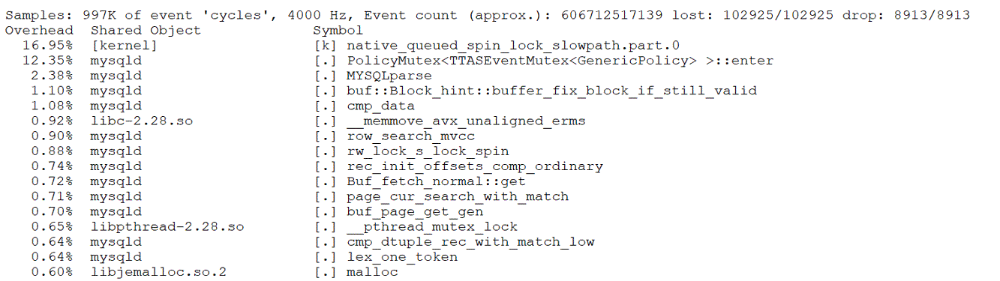

Figure 10. Latch-related bottleneck observed in *perf* screenshot.

From the figure, it is evident that the latch-related bottlenecks are quite pronounced. After the code modifications, here is the *perf* screenshot at 3000 concurrency:

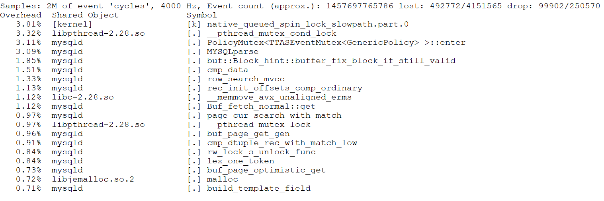

Figure 11. Significant alleviation of latch-related bottleneck.

Even with higher concurrency, such as 3000, the bottlenecks are not pronounced. This suggests that the optimizations have effectively alleviated the latch-related performance problems, improving scalability under extreme conditions.

Excluding the global latch before and after the *view_close* function call improves scalability, while including it severely degrades scalability under high concurrency. Although the *view_close* function operates efficiently within its critical section, frequent acquisition of the globally used *trx-sys* latch—used throughout the *trx-sys* subsystem—causes significant contention and head-of-line blocking. This issue, known as the 'double latch' problem, arises from both *view_open* and *view_close* requiring the global *trx-sys* latch. Notably, removing the latch from the final stage or using a new latch can significantly mitigate this problem.


## References：

[1] Adnan Alhomssi and Viktor Leis. 2023. Scalable and Robust Snapshot Isolation for High-Performance Storage Engines. Proc. VLDB Endow. 16, 6 (2023), 1426–1438.

[2] Andres Freund. 2020. Improving Postgres Connection Scalability: Snapshots. techcommunity.microsoft.com.

[3] Bin Wang (2024). The Art of Problem-Solving in Software Engineering:How to Make MySQL Better.

[4] Harizopoulos, S. and Ailamaki, A. 2003. A case for staged database systems. In Proceedings of the Conference on Innovative Data Systems Research (CIDR). Asilomar, CA. Harizopoulos, S. and Ailamaki, A. 2003. A case for staged database systems. In Proceedings of the Conference on Innovative Data Systems Research (CIDR). Asilomar, CA.