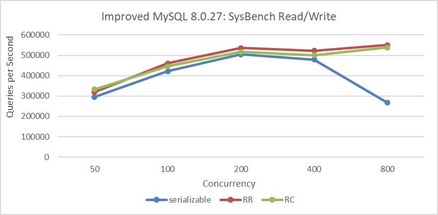
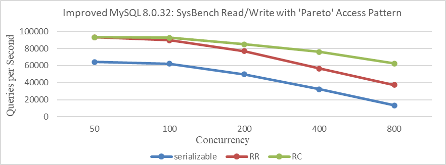

## How to explain why Repeatable Read surprisingly outperforms Read Committed?

Transaction isolation is fundamental to database processing, represented by the 'I' in the ACID acronym. The isolation level determines the balance between performance and the reliability, consistency, and predictability of results when multiple transactions concurrently make changes and queries. Commonly used isolation levels are Read Committed, Repeatable Read, and Serializable. By default, InnoDB uses Repeatable Read.

InnoDB employs distinct locking strategies for each isolation level, impacting query locking behavior under concurrent conditions. Depending on the isolation level, queries may need to wait for locks currently held by other sessions before execution begins [1]. There's a common perception that stricter isolation levels can degrade performance. How does MySQL perform in practical scenarios?

Tests were conducted across Serializable, Repeatable Read (RR), and Read Committed (RC) isolation levels using two benchmark types: SysBench uniform and pareto tests. The SysBench uniform test simulates low-conflict scenarios, while the SysBench pareto test models high-conflict situations. Due to excessive deadlock logs generated during the SysBench pareto test, which significantly interfered with performance analysis, these logs were suppressed by modifying the source code to ensure fair testing conditions. Moreover, the MySQL testing program utilized a modified version for accuracy, rather than the original version.

The figure below presents results from the SysBench uniform test, where concurrency increases from 50 to 800 in doubling increments. Given the few conflicts in this test type, there is little variation in throughput among the three transaction isolation levels at low concurrency levels. However, beyond 400 concurrency, the throughput of the Serializable isolation level exhibits a notable decline.

Figure 1. SysBench read-write performance comparison with low conflicts under different isolation levels.

Below 400 concurrency, the differences are minor because of fewer conflicts in the uniform test. With fewer conflicts, the impact of lock strategies under different transaction isolation levels is reduced. However, Read Committed is mainly constrained by frequent acquisition of MVCC ReadView, resulting in performance inferior to Repeatable Read.

Continuing with the SysBench test under pareto distribution conditions, specific comparative test results can be seen in the following figure.

Figure 2. SysBench read-write performance comparison with high conflicts under different isolation levels.

The figure clearly illustrates that in scenarios with significant conflicts, performance differences due to lock strategies under different transaction isolation levels are pronounced. As anticipated, higher transaction isolation levels generally exhibit lower throughput, particularly under severe conflict conditions.

In scenarios with few conflicts, performance is primarily constrained by the overhead of acquiring ReadView in MVCC. This is because, under the Read Committed isolation level, MySQL must copy the entire active transaction list each time it reads from the global active transaction list, whereas under Repeatable Read, it only needs to obtain a copy of the active transaction list at the start of the transaction.

In summary, in low-conflict tests like SysBench uniform, the overhead of MVCC ReadView is the predominant bottleneck, outweighing lock overhead. Consequently, Repeatable Read performs better than Read Committed. Conversely, in high-conflict tests like SysBench pareto, lock overhead becomes the primary bottleneck, resulting in Read Committed outperforming Repeatable Read.

## References：

[1] https://dev.mysql.com/doc/refman/8.0/en/.

[2] Bin Wang (2024). The Art of Problem-Solving in Software Engineering:How to Make MySQL Better.