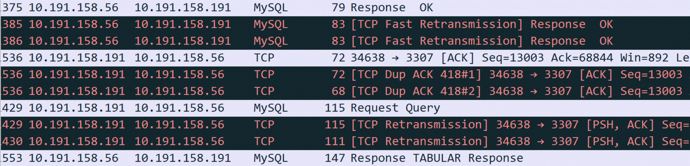
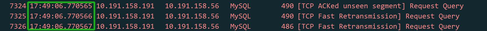
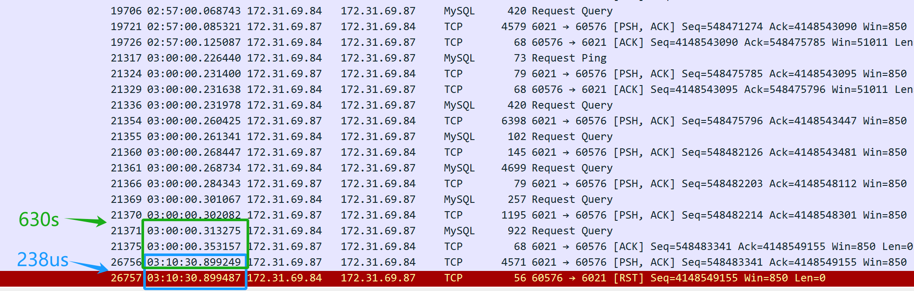
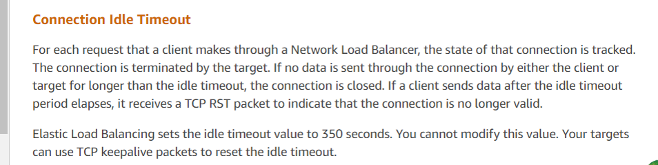

# Logical Reasoning in Network Problems

## 1.1 Classic Case 1

Many software professionals lack in-depth knowledge of TCP/IP logic reasoning, which often leads to misidentifying problems as mysterious problems. Some are discouraged by the complexity of TCP/IP networking literature, while others are misled by confusing details in Wireshark. For instance, a DBA facing performance problems might misinterpret packet capture data in Wireshark, erroneously concluding that TCP retransmissions are the cause.

Figure 1. Packet capture screenshot provided by DBA suspecting retransmission problems.

Since retransmission is suspected, it's essential to understand its nature. Retransmission fundamentally involves timeout retransmission. To confirm if retransmission is indeed the cause, time-related information is necessary, which is not provided in the screenshot above. After requesting a new screenshot from the DBA, the timestamp information was included.

Figure 2. Packet capture screenshot with time information added.

When analyzing network packets, timestamp information is crucial for accurate logical reasoning. A time difference in the microsecond range between two duplicate packets suggests either a timeout retransmission or duplicate packet capture. In a typical LAN environment with a Round-trip Time (RTT) of around 100 microseconds, where TCP retransmissions require at least one RTT, a retransmission occurring at just 1/100th of the RTT likely indicates duplicate packet capture rather than an actual timeout retransmission.

## 1.2 Classic Case 2

Another classic case illustrates the importance of logical reasoning in network problem analysis.

One day, one business developer came rushing over, saying that a scheduled script using the MySQL database middleware had failed in the early morning hours with no response. Upon hearing about the problem, I checked the error logs of the MySQL database middleware but found no valuable clues. So, I asked the developers if they could reproduce the problem, knowing that once reproducible, a problem becomes easier to solve.

The developers tried multiple times to reproduce the problem but were unsuccessful. However, they made a new discovery: they found that executing the same SQL queries during the day resulted in different response times compared to the early morning. They suspected that when the SQL response was slow, the MySQL database middleware was blocking the session and not returning results to the client.

Based on this insight, the database operations team were asked to modify the script's SQL to simulate a slow SQL response. As a result, the MySQL database middleware returned the results without encountering the hang problem seen in the early morning hours.

For a while, the root cause couldn't be identified, and developers discovered a functional problem with the MySQL database middleware. Therefore, developers and DBA operations became more convinced that the MySQL database middleware was delaying responses. In reality, these problems were not related to the response times of the MySQL database middleware.

From the events of the first day, the problem did indeed occur. Everyone involved tried to pinpoint the cause, making various guesses, but the true reason remained elusive.

The next day, developers reported that the script problem reoccurred in the early morning, yet they couldn't reproduce it during the day. Developers, feeling pressured as the script was soon to be used online, complained about the situation. My only suggestion was for them to use the script during the day to avoid problems in the early morning. With all suspicions focused on the MySQL database middleware, it was challenging to analyze the problem from other perspectives.

As a developer responsible for the MySQL database middleware, such mysterious problems cannot be easily overlooked. Ignoring them could impact subsequent use of the MySQL database middleware, and there is also pressure from leadership to solve the problem promptly. Finally, it was decided to implement a low-cost packet capture analysis solution: during the execution of the script in the early morning, packet captures would be performed on the server to analyze what was happening at that time. The goal was to determine if the MySQL database middleware either failed to send a response at all or if it did send a response that the client script did not receive. Once it could be confirmed that the MySQL database middleware did send a response, the problem would not be attributed to the MySQL database middleware developers.

On the third day, developers reported that the early morning problem did not recur, and packet capture analysis confirmed that the problem did not occur. After careful consideration, it seemed unlikely that the problem was solely with the MySQL database middleware: frequent occurrences in the early morning and rare occurrences during the day were puzzling. The only course of action was to wait for the problem to occur again and analyze it based on the packet captures.

On the fourth day, the problem did not surface again.

However, on the fifth day, the problem finally reappeared, bringing hope for resolution.

The packet capture files are numerous. First, ask the developers to provide the timestamp when the problem occurred, then search through the extensive packet capture data to identify the SQL query that caused the problem. The final result is as follows:

Figure 3. Key packet information captured for problem resolution.

From the packet capture content above (captured from the server), it appears that the SQL query was sent at 3 AM. The MySQL database middleware took 630 seconds (03:10:30.899249-03:00:00.353157) to return the SQL response to the client, indicating that the MySQL database middleware did indeed respond to the SQL query. However, just 238 microseconds later (03:10:30.899487-03:10:30.899249), the server's TCP layer received a reset packet, which is suspiciously quick. It's important to note that this reset packet cannot be immediately assumed to be from the client.

Firstly, it is necessary to confirm who sent the reset packet—either it was sent by the client or by an intermediate device along the way. Since packet capture was performed only on the server side, information about the client's packet situation is not available. By analyzing the packet capture files from the server side and applying logical reasoning, the aim is to identify the root cause of the problem.

If the assumption is made that the client sent a reset, it would imply that the client's TCP layer no longer recognizes the TCP state of this connection—transitioning from an established state to a nonexistent one. This change in TCP state would notify the client application of a connection problem, causing the client script to immediately error out. However, in reality, the client script is still waiting for the response to come back. Therefore, the assumption that the client sent a reset does not hold true—the client did not send a reset. The client's connection is still active, but on the server side, the corresponding connection has been terminated by the reset.

Who sent the reset, then? The primary suspect is Amazon's cloud environment. Based on this packet capture analysis, the DBA operations queried Amazon customer service and received the following information:

Figure 4. Final response from Amazon customer service.

Customer service's response aligns with the analysis results, indicating that Amazon's ELB (Elastic Load Balancer, similar to LVS) forcibly terminated the TCP session. According to their feedback, if a response exceeds the 350-second threshold (as observed in the packet capture as 630 seconds), Amazon's ELB device sends a reset to the responding party (in this case, the server). The client scripts deployed by the developers did not receive the reset and mistakenly assumed the server connection was still active. Official recommendations for such problems include using TCP keepalive mechanisms to mitigate these problems.

With the official response obtained, the problem was considered fully solved.

This specific case illustrates how online problems can be highly complex, requiring the capture of critical information—in this instance, packet capture data—to understand the situation as it occurred. Through logical reasoning and the application of reductio ad absurdum, the root cause was identified.