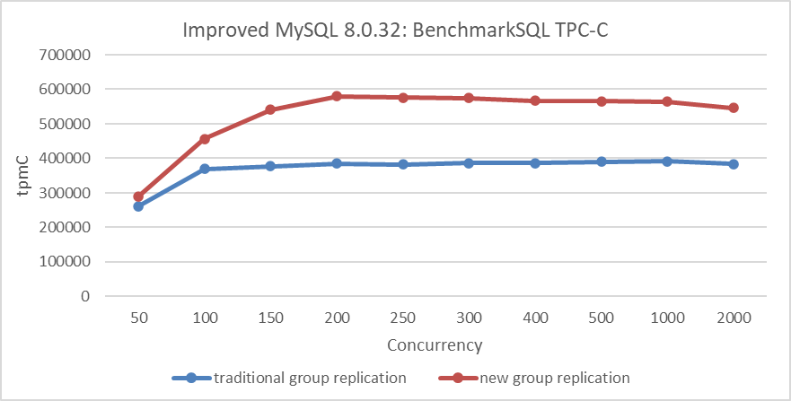

# Comparing Performance with Traditional Group Replication

The figure below compares TPC-C throughput against concurrency levels in different modes. The deployment setup is as follows: Both MySQL primary and secondary are deployed on the same machine, with NUMA binding isolation to prevent computational interference. Separate SSDs are used for the primary and secondary to ensure no I/O operation interference.

Figure 1. Effects of the new Group Replication single-primary mode design.

From the figure, it is evident that the new Group Replication single-primary mode design comprehensively outperforms the traditional mode of Group Replication.

# References：

[1] Bin Wang (2024). The Art of Problem-Solving in Software Engineering:How to Make MySQL Better.