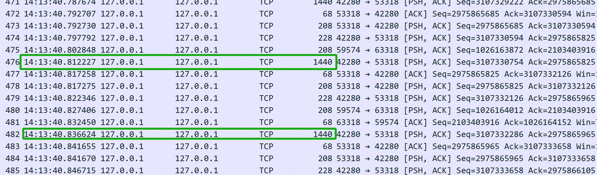
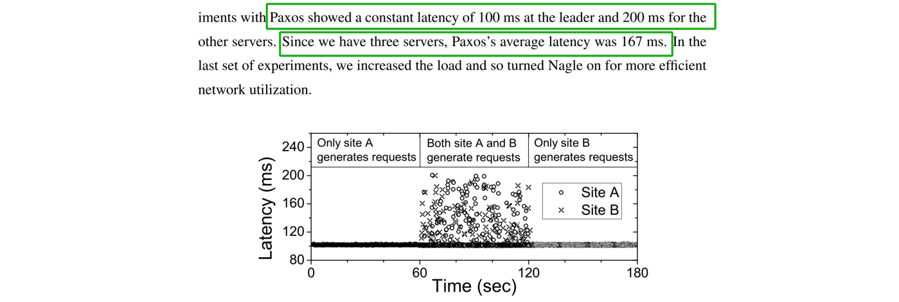
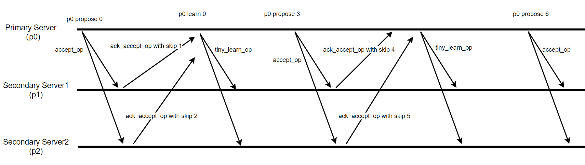
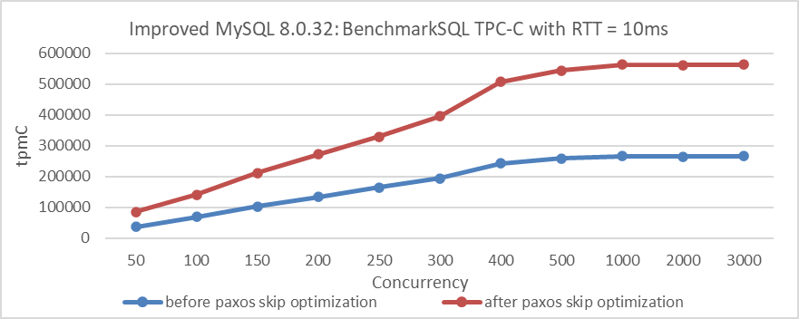

# The Problems with Paxos Variant Algorithms

### 1 The Problems with Implementing Mencius in Group Replication

Group Replication employs Mencius, a multi-leader state machine replication protocol derived from Paxos, at its core. Mencius is novel in that it not only partitions sequence numbers but also addresses key performance problems like adapting to changing client loads and asymmetric network bandwidth.

Mencius achieves this by using a simplified version of consensus called simple consensus. This allows servers with low client load to skip their turns without needing majority agreement. By opportunistically piggybacking SKIP messages on other messages, Mencius enables servers to skip turns with minimal communication and computation overhead, allowing it to efficiently adapt to client and network load variance [1].

Unfortunately, Group Replication did not adhere to the above design. The cost of waiting for SKIP information remains significant, leading to Group Replication experiencing potential throughput fluctuations and longer-than-expected response times, especially in cross-datacenter deployment scenarios.

### 2 Why Add Its Own Implementation of Multi-Paxos?

Given that MySQL introduced a new Multi-Paxos algorithm in addition to the existing Mencius algorithm, this indicates either an inadequacy in the Mencius implementation or inherent problems with the Mencius algorithm itself.

Regarding the Mencius algorithm, the following aspects are particularly noteworthy [1]:

*By opportunistically piggybacking SKIP messages on other messages, Mencius allows servers to skip turns with little or no communication and computation overhead. This allows Mencius to adapt inexpensively to client and network load variance.*

It can be inferred that the Mencius algorithm performs well even under severe leader imbalance, as both theoretical validation and practical evidence support this. Therefore, the problems are likely due to an inadequate implementation of the Mencius algorithm.

When there are no theoretical problems with the Mencius algorithm, introducing a new Multi-Paxos algorithm is not an elegant solution and brings several challenges:

1.  **High Maintenance Cost**: Maintaining and testing two sets of codebases doubles the workload for this part.
2.  **Regression Testing Challenges**: In practice, the new algorithm has led to several regression problems, some of which are difficult to address.
3.  **Partial Problem-Solving**: The new algorithm may only partially address the requirements. In Group Replication's single-primary mode, it might not be universally applicable, as consistent read and write operations require all nodes to continuously communicate information.

### 3 The Specific Implementation of Paxos Skip Optimization

First, let's investigate the performance problems of the MySQL Mencius algorithm implementation. The following figure illustrates the network interaction status when the Mencius algorithm operates stably with a network delay of 10ms:

Figure 1. Insights into the Mencius protocol from packet capture data.

The green box in the figure indicates that the time interval between two consecutive Paxos instances reached 24ms. This suggests that the Mencius algorithm in MySQL is not aligned with a single Round-trip Time (RTT) in its implementation.

Next, let's refer to the Mencius algorithm paper *"State Machine Replication for Wide Area Networks"* [2]. The specific details of the network testing environment are as follows:

From the green box, it is evident that the network latency tested in the paper is RTT=100ms. Let's now examine the relevant information on Paxos processing provided in the paper.

Figure 2. Consensus mechanism of the Mencius protocol as indicated in the Mencius paper.

Based on the figure, it can be inferred that if only one node generates a request, the Mencius protocol consensus requires 100ms, equivalent to one round-trip time (RTT). This indicates that from the Group Replication primary node's perspective, Mencius consensus can be achieved within a single RTT. With the theoretical feasibility clarified, the following discussion will focus on optimizing Group Replication's Mencius communication.

The theoretical basis for optimizing Mencius includes [1]:

*Skipping is the core technique that makes Mencius efficient.*

The specific Paxos network interaction diagram after Paxos skip optimization is shown in the following figure:

Figure 3. Mechanism of Paxos skip optimization.

When a Paxos node receives an *accept_op* message from the Paxos leader and has no messages to propose itself, it can include skip information when sending the *ack_accept_op* message. This informs other nodes that the current node will not propose any messages in this round. During normal stable operation, every *accept_op* message can be handled this way by Paxos nodes.

In the specific implementation, the impact of pipelining must also be considered. During the Paxos skip optimization process, it is necessary to record these skip actions to avoid interference between communications of different Paxos instances.

Finally, under a network delay scenario of 10ms, evaluating the effectiveness of Paxos skip optimization shows significant benefits. Here is a comparison of TPC-C throughput at different concurrency levels before and after Paxos skip optimization:

Figure 4. Impact of Paxos skip optimization on BenchmarkSQL tests with 10ms latency.

From the figure, it's clear that Paxos skip optimization significantly improves performance with a 10ms network latency. Extensive TPC-C testing confirms that this optimization improves performance for Group Replication, whether using a single primary or multiple primaries, and supports consistent reads and writes.

Paxos skip optimization reduces code complexity by an order of magnitude compared to Multi-Paxos implementations with a single leader. It also minimizes regression testing problems and simplifies maintenance.

Overall, leveraging theoretical and logical solutions elegantly addresses this problem more effectively than the current native MySQL implementation [3].

## References：

[1] Y. Mao, F. P. Junqueira, and K. Marzullo. Mencius: building efficient replicated state machines for WANs. In Proc. 8th USENIX OSDI, pages 369--384, San Diego, CA, Dec. 2008.

[2] Yanhua Mao. 2010. State Machine Replication for Wide Area Networks. Doctor of Philosophy in Computer Science. UNIVERSITY OF CALIFORNIA, SAN DIEGO.

[3] Bin Wang (2024). The Art of Problem-Solving in Software Engineering:How to Make MySQL Better.

