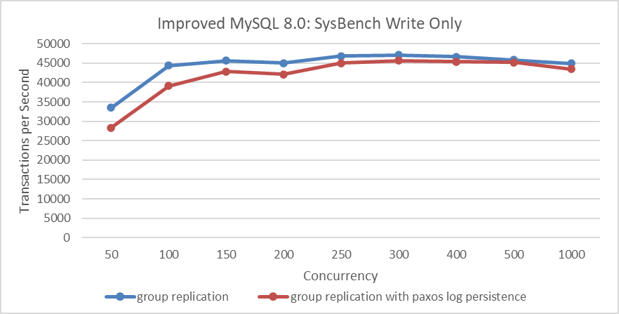
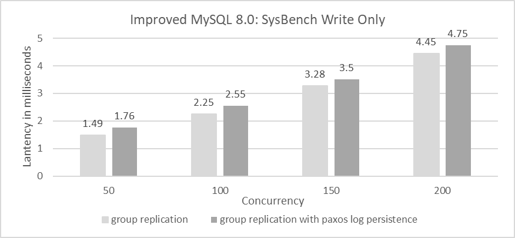
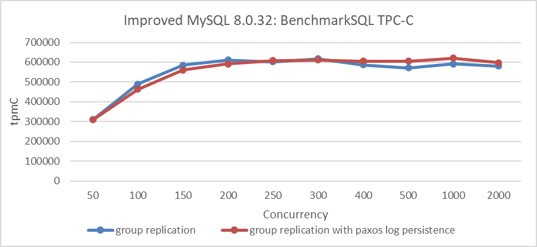

# Lack of Durability: Paxos Not Committed to Disk

Below is Meta company engineers' view on Group Replication [1]:

*Another significant and deliberate choice was to not use Group Replication offered by MySQL 5.7 onwards. While there are significant advancements offered by the protocol (such as the multi-primary mode), using Group Replication in our deployment presented significant challenges. It is based on a variant of Paxos which does not use a persistent log. Entries are written to the log only after they are considered committed via in-memory consensus rounds. The leader election algorithm is local and deterministic. It also doesn't consider lag when choosing a new leader and brief network blips trigger a computationally expensive recovery algorithm. This option could have worked but not without excessive engineering effort to fix the drawbacks.*

The main problem with Group Replication, as outlined in the above content, is the lack of persistence in Paxos messages. The initial design background includes:

1. Suboptimal SSD hardware performance.

2. Paxos log persistence not meeting the requirements for Group Replication with multiple primaries.

   Without persistent storage in certification databases, Group Replication cannot use Paxos message persistence for crash recovery. After MySQL restarts, there is no corresponding certification database, making continued processing of persisted Paxos messages prone to inconsistent states.

Based on Group Replication single-primary mode using SSDs, SysBench write-only tests were used to examine the impact of adding Paxos persistence on throughput. Please refer to the specific figure below:

Figure 1. Performance overhead of Paxos log persistence in SysBench write-only tests.

From the figure, it can be seen that after adding Paxos persistence, there is a slight decrease in performance under low concurrency, which is an expected result. However, under high concurrency, the difference is not significant. This is because, under high concurrency, Paxos uses a batching mechanism that allows multiple transaction records to be logged into the Paxos instance together, thereby reducing I/O pressure.

Next, let's examine the comparative response times.

Figure 2. After adding Paxos log persistence, the average response time in SysBench write-only tests increased.

The figure shows response times for 50 to 200 concurrent scenarios. The increase in average response time with Paxos log persistence is acceptable. SysBench write-only tests stress Group Replication significantly, while TPC-C tests, due to their read operations, reduce the write pressure on Group Replication. For comparisons based on Group Replication in single-primary mode, using SSDs, and BenchmarkSQL for TPC-C throughput at various concurrency levels, please refer to the figure below.

Figure 3. Performance overhead of Paxos log persistence in BenchmarkSQL tests.

The figure shows that, at low concurrency levels, the version with Paxos log persistence has slightly lower throughput, though the impact is much smaller compared to SysBench write-only tests. Based on the results of the various tests, it can be concluded that, under current SSD hardware conditions, employing Paxos log persistence is a viable solution [2].

## References：

[1] Ritwik Yadav and Anirban Rahut. 2023. FlexiRaft: Flexible Quorums with Raft. The Conference on Innovative Data Systems Research (CIDR) (2023).

[2] Bin Wang (2024). The Art of Problem-Solving in Software Engineering:How to Make MySQL Better.

