# Solved Performance Degradation in Query Execution Plans

During secondary development on MySQL 8.0.27, TPC-C tests with BenchmarkSQL became unstable. Throughput rapidly declined, complicating optimization. Trust in the official version led to initially overlooking this problem despite testing difficulties.

Only after a user reported a significant performance drop following an upgrade did we begin to take it seriously. The reliable feedback from users indicated that while MySQL 8.0.25 performed well, upgrading to MySQL 8.0.29 led to a substantial decline. This crucial information indicated that there was a performance problem.

Simultaneously, it was confirmed that the performance degradation problem in MySQL 8.0.27 was the same as in MySQL 8.0.29. MySQL 8.0.27 had undergone two scalability optimizations specifically for trx-sys, which theoretically should have increased throughput. Reviewing the impact of latch sharding in trx-sys on performance:


Figure 1. Impact of latch sharding in trx-sys under different concurrency levels.

Let's continue examining the comparison of throughput and concurrency between trx-sys latch sharding optimization and the MySQL 8.0.27 release version. Specific details are shown in the following figure:

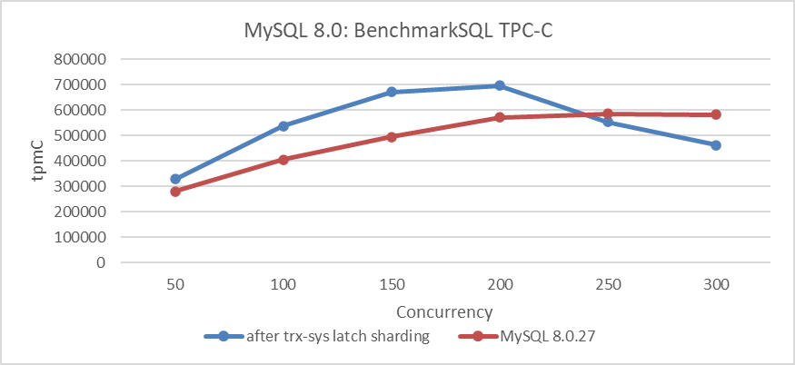

Figure 2. Performance degradation in MySQL 8.0.27 release version.

From the figure, it is evident that the performance degradation of the MySQL 8.0.27 release version is significant under low concurrency conditions, with a noticeable drop in peak performance. This aligns with user feedback regarding decreased throughput and is easily reproducible using BenchmarkSQL.

The MySQL 8.0.27 release version already had this problem, whereas the earlier MySQL 8.0.25 release version did not. Using this information, the goal was to identify the specific git commit that caused the performance degradation. Finding the git commit responsible for performance degradation is a complex process that typically involves binary search. After extensive testing, it was initially narrowed down to a specific commit. However, this commit contained tens of thousands of lines of code, making it nearly impossible to pinpoint the exact segment causing the problem. It was later discovered that this commit was a collective merge from a particular branch. This allowed for further breakdown and ultimately identifying the root cause of the problem in the following:

```c++
commit 9a13c1c6971f4bd56d143179ecfb34cca8ecc018
Author: Steinar H. Gunderson <steinar.gunderson@oracle.com>
Date:   Tue Jun 8 15:14:35 2021 +0200

    Bug #32976857: REMOVE QEP_TAB_STANDALONE [range optimizer, noclose]

    Remove the QEP_TAB dependency from test_quick_select() (ie., the range
    optimizer).

    Change-Id: Ie0fcce71dfc813920711c43c3d62635dae0d7d20
```

Using the commit information, two versions were compiled and SQL queries performing exceptionally slow in TPC-C tests were identified. The execution plans of these slow SQL queries were analyzed using *'explain'*. Specific details are shown in the following figure:

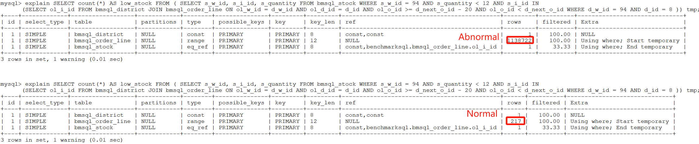

Figure 3. Abnormalities indicated by rows in *'explain'*.

From the figure, it can be seen that most of the execution plans are identical, except for the *'rows'* column. In the normal version, the *'rows'* column shows just over 200, whereas in the problematic version, it shows over 1,000,000. After continuously simplifying the SQL, a highly representative SQL query was finally identified. Specific details are shown in the following figure:

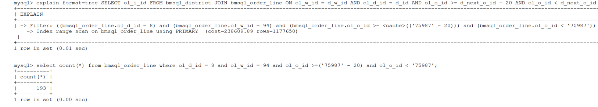

Figure 4. Significant discrepancies between SQL execution results and *'explain'* output.

Based on the *Filter* information obtained from '*explain*', the last query shown in the figure was constructed. The figure reveals that while the last query returned only 193 rows, '*explain*' displayed over 1.17 million rows for *'rows'*. This discrepancy highlights a complex problem, as execution plans are not always fully understood by all MySQL developers. Fortunately, identifying the commit responsible for the performance degradation provided a critical foundation for solving the problem. Although solving the problem was relatively straightforward with this information, analyzing the root cause from the SQL statement itself proved to be far more challenging.

Let's continue with an in-depth analysis of this problem. The following figure displays the '*explain*' result for a specific SQL query:

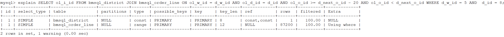

Figure 5. Sample SQL query representing the problem.

From the figure, it can be seen that the number of rows is still large, indicating that this SQL query is representative.

Two different debug versions of MySQL were compiled: one with anomalies and one normal. Debug versions were used to capture useful function call relationships through debug traces. When executing the problematic SQL statement on the version with anomalies, the relevant debug trace information is as follows:

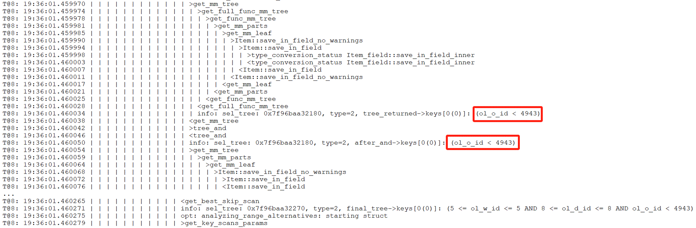

Figure 6. Debug trace information for the abnormal version.

Similarly, for the normal version, the relevant debug trace information is as follows:

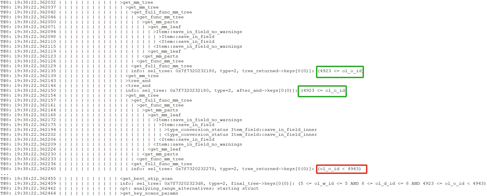

Figure 7. Debug trace information for the normal version.

Comparing the two figures above, it is noticeable that the normal version includes additional content within the green box, indicating that conditions are applied in the normal version, whereas the abnormal version lacks these conditions. To understand why the abnormal version is missing these conditions, it is necessary to add additional trace information in the *get_full_func_mm_tree* function to capture specific details about the cause of this difference.

After adding extra trace information, the debug trace result for the abnormal version is as follows:

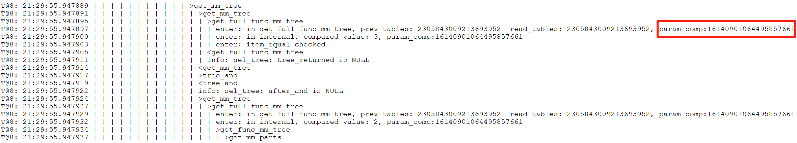

Figure 8. Supplementary debug trace information for the abnormal version.

The debug trace result for the normal version is as follows:

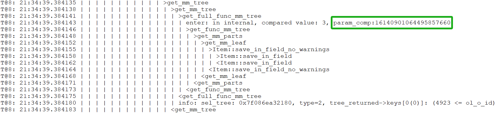

Figure 9. Supplementary debug trace information for the normal version.

Upon comparing the two figures above, significant differences are observed. In the normal version, the value of *param_comp* is 16140901064495857660, while in the abnormal version, it is 16140901064495857661, differing by 1. To understand this discrepancy, let's first examine how the *param_comp* value is calculated, as detailed in the following code snippet:

```c++
static SEL_TREE *get_full_func_mm_tree(THD *thd, RANGE_OPT_PARAM *param,
                                       table_map prev_tables,
                                       table_map read_tables,
                                       table_map current_table,
                                       bool remove_jump_scans, Item *predicand,
                                       Item_func *op, Item *value, bool inv) {
  SEL_TREE *tree = nullptr;
  SEL_TREE *ftree = nullptr;
  const table_map param_comp = ~(prev_tables | read_tables | current_table);
  DBUG_TRACE;
  ...
```

From the code, it's evident that *param_comp* is calculated using a bitwise OR operation on three variables, followed by a bitwise NOT operation. The difference of 1 suggests that at least one of these variables differs, helping to narrow down the problem.

The calculation involves three *table_map* variables with lengthy values, making ordinary calculators insufficient and the process too complex to detail here.

The key point is that debug tracing revealed critical differences. Coupled with the information provided by identifying the Git commit responsible for the performance discrepancy, analyzing the root cause is no longer difficult.

Here is the final fix patch, detailed as follows:

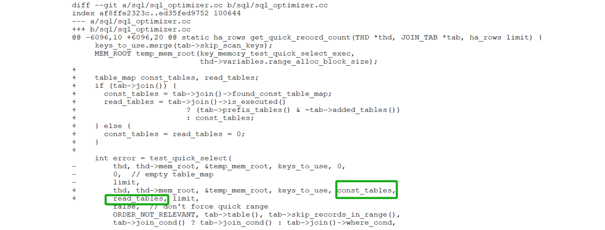

Figure 10. Final patch for solving performance degradation in query execution plans.

When calling the *test_quick_select* function, reintroduce the *const_table* and *read_tables* variables (related to the previously discussed variables). This ensures that filtering conditions in the execution plan are not overlooked.

After applying the above patch to MySQL 8.0.27, the performance degradation problem was solved. A test comparing TPC-C throughput at various concurrency levels, both before and after applying the patch, was conducted. Specific details are shown in the following figure:

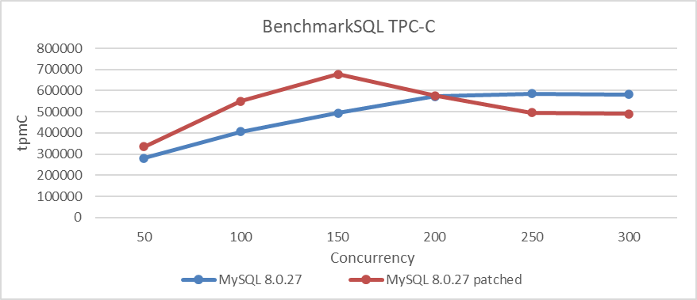

Figure 11. Effects of the patch on solving performance degradation.

From the figure, it is evident that after applying the patch, throughput and peak performance have significantly improved under low concurrency conditions. However, under high concurrency conditions, throughput not only failed to increase but actually decreased, likely due to scalability bottlenecks in MVCC ReadView.

After addressing the MVCC ReadView scalability problem, reassess the impact of this patch, as detailed in the figure below:

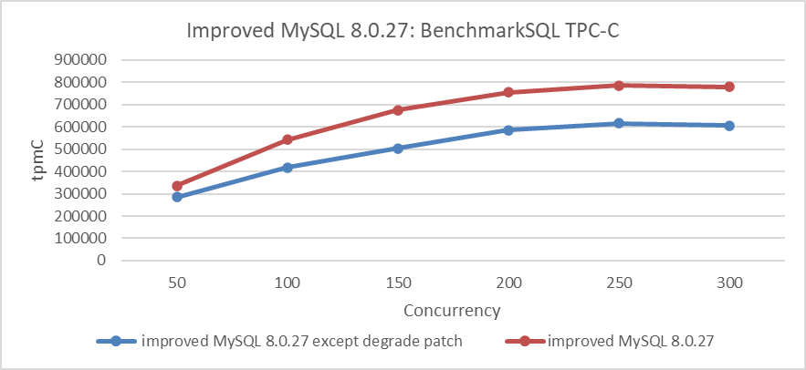

Figure 12. Actual effects of the patch after addressing the MVCC ReadView scalability problem.

From the figure, it is evident that this patch has significantly improved MySQL's throughput. This case demonstrates that scalability problems can disrupt certain optimizations. To scientifically assess the effectiveness of an optimization, it is essential to address most scalability problems beforehand to achieve a more accurate evaluation.

Finally, let's examine the results of the long-term stability testing for TPC-C. The following figure shows the results of an 8-hour test under 100 concurrency, with throughput captured at various hours (where 1 ≤ n ≤ 8).

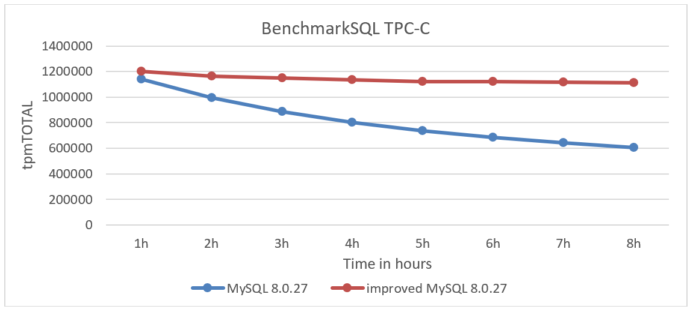

Figure 13. Comparison of stability tests: MySQL 8.0.27 vs. improved MySQL 8.0.27.

From the figure, it is evident that after applying the patch, the rate of throughput decline has been significantly mitigated. The MySQL 8.0.27 version experienced a dramatic throughput decline, failing to meet the stability requirements of TPC-C testing. However, after applying the patch, MySQL's performance returned to normal.

Addressing this problem directly presents considerable challenges, particularly for MySQL developers unfamiliar with query execution plans. Using logical reasoning and a systematic approach to identify and address code differences before and after the problem arose is a more elegant problem-solving method, though it is complex.

It is noteworthy that no regression testing problems were encountered after applying the patch, demonstrating high stability and providing a solid foundation for future performance improvements. Currently, MySQL 8.0.38 still hasn't solved this problem, suggesting potential shortcomings in MySQL's testing system. Given the complexity of MySQL databases, users should exercise caution when upgrading and consider using tools like TCPCopy [2] to avoid potential regression testing problems.

## References：

[1] Bin Wang (2024). The Art of Problem-Solving in Software Engineering:How to Make MySQL Better.

[2] https://github.com/session-replay-tools/tcpcopy.