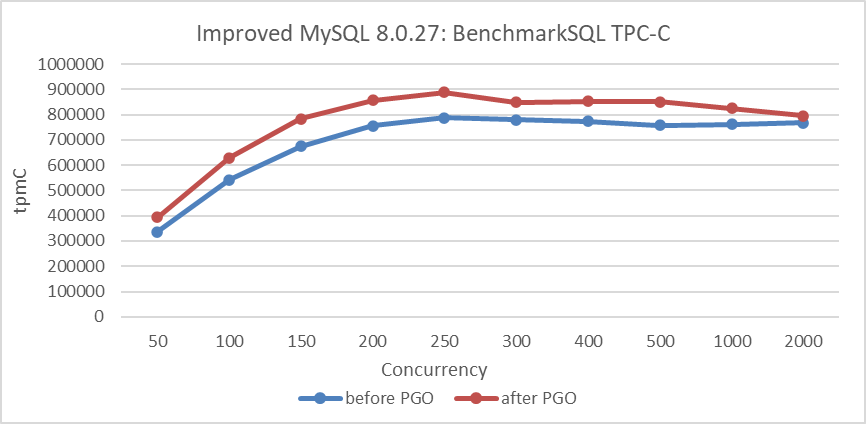
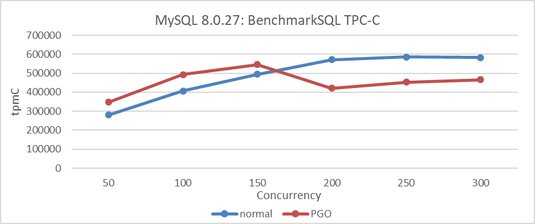
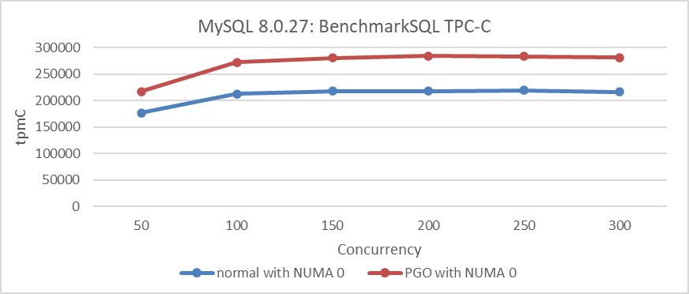
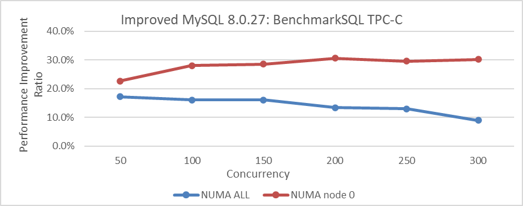
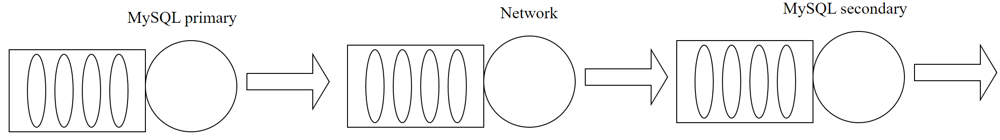
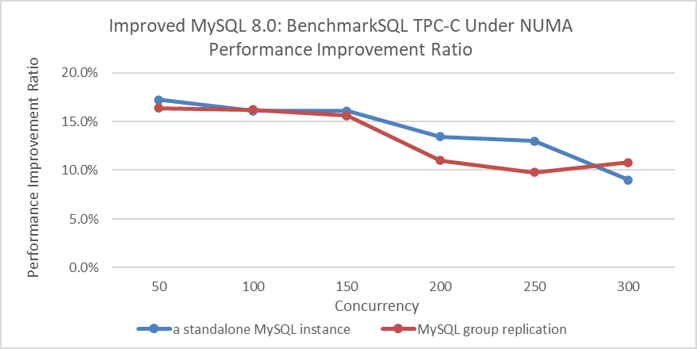

# PGO

Profile-guided optimization (PGO) typically improves program execution efficiency. The following figure illustrates how PGO improves the throughput of a standalone MySQL instance under various concurrency levels, following the resolution of MySQL MVCC ReadView scalability problems.

Figure 1. Impact of PGO after solving MVCC ReadView scalability problems.

From the figure, it is evident that PGO has a notable impact.

For MySQL 8.0.27 with PGO, throughput decreases under high concurrency conditions. The specific details are shown in the figure below:

Figure 2. Performance comparison tests before and after using PGO in MySQL 8.0.27.

The test results above indicate that PGO for MySQL's improvement requires addressing scalability problems before its full potential can be realized. It should be noted that both comparative tests above were conducted in mainstream NUMA environments. When MySQL is bound to a single NUMA node, creating an SMP environment, the following figure shows the relationship between TPC-C throughput and concurrency levels before and after PGO.

Figure 3. Performance comparison tests before and after using PGO in MySQL 8.0.27 under SMP.

From the figure, it can be seen that PGO consistently improves throughput in SMP environments, without decreasing as concurrency levels increase. The following figure compares the performance improvement of PGO between NUMA and SMP environments.

Figure 4. Performance of PGO optimization in different environments.

From the figure, it is evident that PGO achieves a maximum performance improvement of up to 30% in SMP environments, whereas in NUMA environments, the performance improvement decreases as concurrency increases. This suggests that PGO has greater potential in SMP environments.

Continuing the analysis, the performance of PGO in a Group Replication cluster environment compared to a single MySQL instance is examined. The following diagram depicts a simplified queue model of Group Replication.

Figure 5. A simplified queue model of Group Replication.

Because the network portion cannot be optimized by PGO, the MySQL primary consumes a lower proportion of time compared to a single MySQL instance. According to Amdahl's Law, the performance gains from PGO will be less pronounced compared to those of a standalone MySQL instance. Generally, as network latency increases, the improvement from PGO tends to diminish.

The following figure compares the throughput improvement of a standalone MySQL instance and Group Replication using PGO.

Figure 6. PGO Performance Improvement in Group Replication vs. Standalone MySQL.

From the figure, it can be observed that the performance improvement from PGO in a Group Replication cluster environment is generally less than that of a standalone MySQL instance.

In conclusion, PGO can be summarized as follows:

1.  For MySQL, PGO is a worthwhile optimization that theoretically improves performance comprehensively, especially in SMP environments.
2.  In NUMA environments, addressing scalability problems is necessary to achieve significant benefits from PGO.
3.  PGO is less effective in a Group Replication cluster compared to a standalone MySQL instance.

# References：

[1] Bin Wang (2024). The Art of Problem-Solving in Software Engineering:How to Make MySQL Better.

