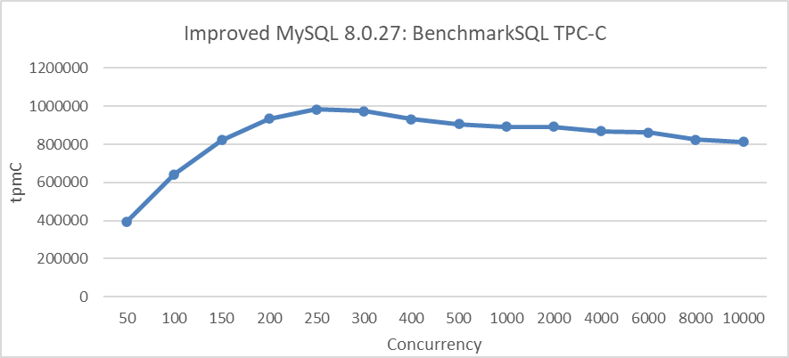

# How can the scalability of MySQL be improved？

##  Current state of MySQL 5.7

MySQL 5.7 is not ideal in terms of scalability. The following figure illustrates the relationship between TPC-C throughput and concurrency in MySQL 5.7.39 under a specific configuration. This includes setting the transaction isolation level to Read Committed and adjusting the *innodb_spin_wait_delay* parameter to mitigate throughput degradation.


Figure 1. Scalability problems in MySQL 5.7.39 during BenchmarkSQL testing.

From the figure, it is evident that scalability problems significantly limit the increase in MySQL throughput. For example, after 100 concurrency, the throughput begins to decline. 

To address the aforementioned performance collapse issue, Percona's thread pool was employed. The following figure illustrates the relationship between TPC-C throughput and concurrency after configuring the Percona thread pool.


Figure 2. Percona thread pool mitigates scalability problems in MySQL 5.7.39.

Although the thread pool introduces some overhead and peak performance has decreased, it has mitigated the issue of performance collapse under high concurrency.

## Current state of MySQL 8.0

Let's take a look at the efforts MySQL 8.0 has made regarding scalability.

### Redo Log Optimization

The first major improvement is redo log optimization [3].

```c++
commit 6be2fa0bdbbadc52cc8478b52b69db02b0eaff40
Author: Paweł Olchawa <pawel.olchawa@oracle.com>
Date:   Wed Feb 14 09:33:42 2018 +0100
    
    WL#10310 Redo log optimization: dedicated threads and concurrent log buffer.

    0. Log buffer became a ring buffer, data inside is no longer shifted.
    1. User threads are able to write concurrently to log buffer. 
    2. Relaxed order of dirty pages in flush lists - no need to synchronize
       the order in which dirty pages are added to flush lists.
    3. Concurrent MTR commits can interleave on different stages of commits.
    4. Introduced dedicated log threads which keep writing log buffer: 
        * log_writer: writes log buffer to system buffers,
        * log_flusher: flushes system buffers to disk.
       As soon as they finished writing (flushing) and there is new data to 
       write (flush), they start next write (flush).
    5. User threads no longer write / flush log buffer to disk, they only
       wait by spinning or on event for notification. They do not have to 
       compete for the responsibility of writing / flushing.
    6. Introduced a ring buffer of events (one per log-block) which are used
       by user threads to wait for written/flushed redo log to avoid:
        * contention on single event
        * false wake-ups of all waiting threads whenever some write/flush
          has finished (we can wake-up only those waiting in related blocks)
    7. Introduced dedicated notifier threads not to delay next writes/fsyncs:
        * log_write_notifier: notifies user threads about written redo,
        * log_flush_notifier: notifies user threads about flushed redo.
    8. Master thread no longer has to flush log buffer.
    ...
    30. Mysql test runner received a new feature (thanks to Marcin):
        --exec_in_background.
    Review: RB#15134
    Reviewers:
        - Marcin Babij <marcin.babij@oracle.com>,
        - Debarun Banerjee <debarun.banerjee@oracle.com>.
    Performance tests:
        - Dimitri Kravtchuk <dimitri.kravtchuk@oracle.com>,
        - Daniel Blanchard <daniel.blanchard@oracle.com>,
        - Amrendra Kumar <amrendra.x.kumar@oracle.com>.
    QA and MTR tests:
        - Vinay Fisrekar <vinay.fisrekar@oracle.com>.
```

A test comparing TPC-C throughput with different levels of concurrency before and after optimization was conducted. Specific details are shown in the following figure:


Figure 3. Impact of redo log optimization under different concurrency levels.

The results in the figure show a significant improvement in throughput at low concurrency levels.

### Optimizing Lock-Sys Through Latch Sharding

The second major improvement is lock-sys optimization [5].

```c++
commit 1d259b87a63defa814e19a7534380cb43ee23c48
Author: Jakub Łopuszański <jakub.lopuszanski@oracle.com>
Date:   Wed Feb 5 14:12:22 2020 +0100
    
    WL#10314 - InnoDB: Lock-sys optimization: sharded lock_sys mutex

    The Lock-sys orchestrates access to tables and rows. Each table, and each row,
    can be thought of as a resource, and a transaction may request access right for
    a resource. As two transactions operating on a single resource can lead to
    problems if the two operations conflict with each other, Lock-sys remembers
    lists of already GRANTED lock requests and checks new requests for conflicts in
    which case they have to start WAITING for their turn.
    
    Lock-sys stores both GRANTED and WAITING lock requests in lists known as queues.
    To allow concurrent operations on these queues, we need a mechanism to latch
    these queues in safe and quick fashion.
    
    In the past a single latch protected access to all of these queues.
    This scaled poorly, and the managment of queues become a bottleneck.
    In this WL, we introduce a more granular approach to latching.
    
    Reviewed-by: Pawel Olchawa <pawel.olchawa@oracle.com>
    Reviewed-by: Debarun Banerjee <debarun.banerjee@oracle.com>
      RB:23836

```

Based on the program before and after optimizing with lock-sys, using BenchmarkSQL to compare TPC-C throughput with concurrency, the specific results are as shown in the following figure:


Figure 4. Impact of lock-sys optimization under different concurrency levels.

From the figure, it can be seen that optimizing lock-sys significantly improves throughput under high concurrency conditions, while the effect is less pronounced under low concurrency due to fewer conflicts. 

### Latch Sharding for trx-sys

The third major improvement is latch sharding for trx-sys.

```c++
commit bc95476c0156070fd5cedcfd354fa68ce3c95bdb
Author: Paweł Olchawa <pawel.olchawa@oracle.com>
Date:   Tue May 25 18:12:20 2021 +0200
    
    BUG#32832196 SINGLE RW_TRX_SET LEADS TO CONTENTION ON TRX_SYS MUTEX
    
    1. Introduced shards, each with rw_trx_set and dedicated mutex.
    2. Extracted modifications to rw_trx_set outside its original critical sections
       (removal had to be extracted outside trx_erase_lists).
    3. Eliminated allocation on heap inside TrxUndoRsegs.
    4. [BUG-FIX] The trx->state and trx->start_time became converted to std::atomic<>
       fields to avoid risk of torn reads on egzotic platforms.
    5. Added assertions which ensure that thread operating on transaction has rights
       to do so (to show there is no possible race condition).
    
    RB: 26314
    Reviewed-by: Jakub Łopuszański jakub.lopuszanski@oracle.com
```

Based on these optimizations before and after, using BenchmarkSQL to compare TPC-C throughput with concurrency, the specific results are as shown in the following figure:


Figure 5. Impact of latch sharding in trx-sys under different concurrency levels.

From the figure, it can be seen that this improvement significantly enhances TPC-C throughput, reaching its peak at 200 concurrency. It is worth noting that the impact diminishes at 300 concurrency, primarily due to ongoing scalability problems in the trx-sys subsystem related to MVCC ReadView. 

## Refining MySQL 8.0

The remaining improvements are our independent enhancements.

### Enhancements to MVCC ReadView

The first major improvement is the enhancement of the MVCC ReadView data structure [1].

Performance comparison tests were conducted to evaluate the effectiveness of the MVCC ReadView optimization. The figure below shows a comparison of TPC-C throughput with varying concurrency levels, before and after modifying the MVCC ReadView data structure.


Figure 6. Performance comparison before and after adopting the new hybrid data structure in NUMA.

From the figure, it is evident that this transformation primarily optimized scalability and improved MySQL's peak throughput in NUMA environments.

### Avoiding Double Latch Problems

The second major improvement we made is addressing the double latch problem, where 'double latch' refers to the requirement for the global trx-sys latch by both view_open and view_close [1].

Using the MVCC ReadView optimized version, compare TPC-C throughput before and after the modifications. Details are shown in the following figure:


Figure 7. Performance improvement after eliminating the double latch bottleneck.

From the figure, it is evident that the modifications significantly improved scalability under high-concurrency conditions. 

### Transaction Throttling Mechanism

The final improvement is the implementation of a  transaction throttling mechanism to guard against performance collapse under extreme concurrency [1] [2] [4].

The following figure depicts the TPC-C scalability stress test conducted after implementing transaction throttling. The test was performed in a scenario with NUMA BIOS disabled, limiting entry of up to 512 user threads into the transaction system.



Figure 8. Maximum TPC-C throughput in BenchmarkSQL with transaction throttling mechanisms.

From the figure, it is evident that implementing transaction throttling mechanisms significantly improves MySQL's scalability.

## Summary

Overall, it is entirely feasible for MySQL to maintain performance without collapse at tens of thousands of concurrent connections in low-conflict scenarios of BenchmarkSQL TPC-C testing.

# References：

[1] Bin Wang (2024). The Art of Problem-Solving in Software Engineering:How to Make MySQL Better.

[2] https://dev.mysql.com/blog-archive/the-new-mysql-thread-pool/.

[3] Paweł Olchawa. 2018. MySQL 8.0: New Lock free, scalable WAL design. dev.mysql.com/blog-archive.

[4] Xiangyao Yu. An evaluation of concurrency control with one thousand cores. PhD thesis, Massachusetts Institute of Technology, 2015.

[5] https://dev.mysql.com/doc/refman/8.0/en/.

