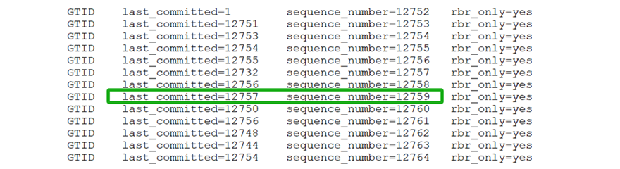
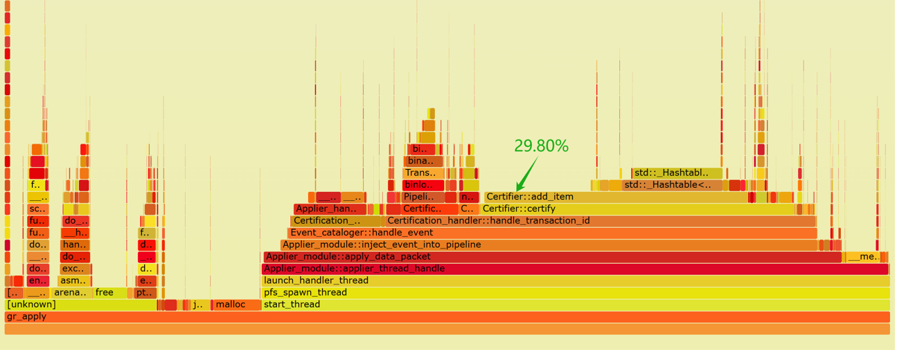
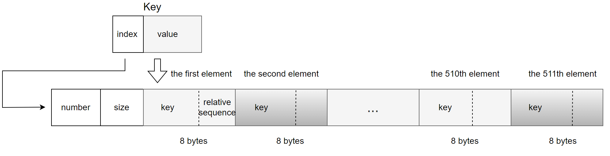
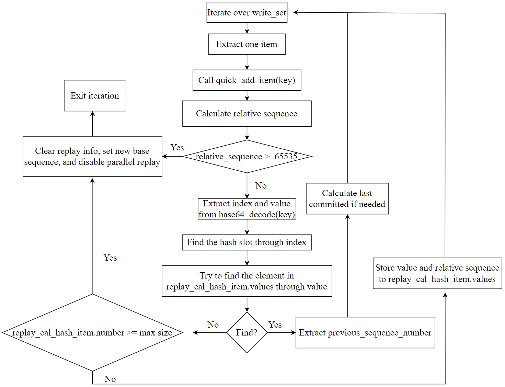
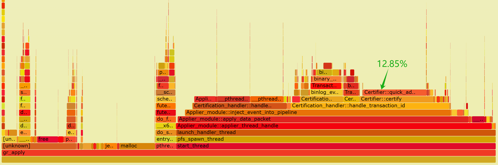

# The Powerful Impact of Static Arrays in MySQL Modifications

First, let's clarify the terms "*sequence_number*" and "*last_committed*":

-   **sequence_number**: This is an automatically incremented value used to track the order of transactions during Group Replication operation. Each transaction is assigned a unique *sequence_number* during operation.
-   **last_committed**: This value indicates the sequence number of the last committed transaction that a new transaction depends on. For a transaction to proceed during replay on a MySQL secondary, the transaction must wait until the one with a *sequence_number* equal to *last_committed* has been fully replayed.

For example, in the transaction highlighted in the green box below, with *sequence_number=12759* and *last_committed=12757*, the *last_committed=12757* indicates that the transaction with *sequence_number=12759* must wait until the transaction with *sequence_number=12757* has been fully replayed before it can proceed.



Figure 1. Typical examples of *sequence_number* and *last_committed*.

Once *sequence_number* and *last_committed* are understood, the calculation of the *last_committed* value can be explored. Typically, this value is derived from the transaction's writeset, which details the rows modified by the transaction. Each row in the writeset is represented by a key corresponding to a table row. In the writeset:

-   For update operations, there are two elements with the same key.
-   For insert and delete operations, there is one element.
-   The writeset for DDL transactions is empty, indicating that DDL operations must be replayed serially.

In Group Replication, when processing a transaction's writeset, the applier thread examines the certification database for transactions that have modified the same records as those in the writeset. If such transactions are found, the applier thread determines the latest *sequence_number* that is smaller than the current transaction's *sequence_number*, which becomes the transaction's *last_committed* value. This ensures transactions are replayed in the correct order to maintain data consistency.

Before diving deeper into the analysis, let's review what the applier thread does:

1.  Calculating *last_committed* based on the certification database.
2.  Writing transaction events to the relay log file.

Below is a flame graph generated from capturing performance data of the applier thread:



Figure 2. Flame graph of performance data for the applier thread.

From the flame graph, it is evident that the *'add_item'* operation in the certification database consumes 29.80% of the computation time, with half of this time spent on hash table operations. The inefficiency of the hash table results in high CPU resource consumption for calculating last_committed, and delays in writing transaction events to disk.

To address this bottleneck and improve disk write performance, the hash table's overhead must be reduced. Since direct improvements to the hash table are challenging, a new data structure is necessary.

Based on the design of Group Replication in single-primary mode, a redesigned data structure has been developed to replace the previous hash table approach in the certification database. This new structure aims to eliminate delays in calculating last_committed and ensure timely writing of transaction events to disk. See the specific code below for the new data structure:

```c++
#define REPLAY_CAL_HASH_ITEMS (REPLAY_CAL_HASH_ITEM / 8)
#define MAX_RELATIVE_SEQUENCE_NUMBER 65535
#define REPLAY_CAL_ARRAY 65536
#define REPLAY_CAL_HASH_ITEM 4088
typedef struct {
  int number;
  int size;
  unsigned char values[REPLAY_CAL_HASH_ITEM];
} replay_cal_hash_item;

class Certifier : public Certifier_interface {
 ...
 private:
  replay_cal_hash_item replayed_cal_array[REPLAY_CAL_ARRAY];
 ...
```

To store the information necessary for calculating *last_committed*, a static array named *replayed_cal_array* is used. This array contains 65,536 elements, each representing a bucket slot with a *replay_cal_hash_item*. The *replay_cal_hash_item* structure includes:

-   **number**: Indicates the current count of elements within the *replay_cal_hash_item*, tracking how many elements are in use.
-   **size**: Specifies the maximum capacity of the *replay_cal_hash_item*, defining the upper limit of elements it can accommodate.
-   **values**: An array of 4,088 unsigned char elements that stores data.

The **values** member is used to store 511 entries, with each entry occupying 8 bytes. Each entry consists of:

-   **Key Value**: 6 byte.
-   **Relative Sequence Number**: 2 bytes.

For specific details, refer to the figure below [1]:



Figure 3. A new data structure suitable for calculating last_committed.

The *key* undergoes base64 conversion into an 8-byte integer. This 8-byte integer is divided as follows:

-   **Index for replayed_cal_array**: The first two bytes serve as an index for the *replayed_cal_array*.
-   **Value**: The remaining six bytes are stored in the first six bytes of each 8-byte entry.

Regarding the storage of *sequence_number*:

-   Only the relative value of the *sequence_number* is stored, calculated as the current *sequence_number* minus a base sequence value.
-   Instead of requiring 8 bytes, this relative *sequence_number* needs only 2 bytes.
-   This 2-byte relative *sequence_number* is stored in the last two bytes of each 8-byte entry.

This setup optimizes storage by using a compact representation of the *key* and storing only the necessary relative *sequence_number*, ensuring efficient memory use within the *replay_cal_hash_item* structure.

The algorithm based on the new data structure is illustrated in the figure below, highlighting the following key points:

1.  Fully utilizes the characteristics of *keys* and the monotonic increase of *sequence* numbers, compressing storage space effectively, resulting in very high memory usage efficiency for the new data structure.
2.  Sets an upper limit on the stored information. Once the threshold is exceeded, a process similar to checkpointing is triggered, and the current transaction is set for serial replay.
3.  The content of the new data structure is relatively small, with a high cache hit rate. Moreover, within *replay_cal_hash_item*, the *values* are stored contiguously, making it very cache-friendly.



Figure 4. A new algorithm suitable for calculating last_committed.

It should be noted that the new data structure occupies a memory footprint of 256MB (65536 \* 4096 bytes), which is significantly smaller compared to the several gigabytes or even tens of gigabytes typically required by traditional certification databases during benchmarking. This modest memory usage lays a solid foundation for optimizing the performance of the entire applier thread.

After optimization, the applier thread has significantly accelerated its computation of the last_committed value, resulting in a considerable improvement in the overall processing speed of the applier thread. The following is a flame graph generated by capturing *perf* data of the applier thread using the improved version.



Figure 5. Flame graph of performance data for the applier thread after optimization.

From the graph, it can be observed that the CPU processing overhead for *Certifier::certify* has significantly reduced. Specifically, *quick_add_item* now accounts for only 12.85% of the overhead, whereas previously, when throughput was lower, *add_item* consumed 29.80%. This highlights a significant performance improvement achieved by adopting the new data structure.

Based on extensive TPC-C testing statistics, the following optimization conclusions can be drawn: Before optimization, the applier thread's disk throughput supported approximately 500,000 tpmC. After optimization, with more CPU time available to process disk writes, the applier thread's disk throughput now supports approximately 1,000,000 tpmC.

This improvement not only enhances the overall processing capability of the applier thread but also accelerates the cleaning of outdated writeset information. According to tests, each cleaning operation now takes milliseconds. As a result, it effectively mitigates the performance fluctuations inherent in native Group Replication, further improving stability.

From this case study, the reasons for performance improvement can be summarized as follows:

1.  **Static Array for Values**: Using a static array for *values* in *replay_cal_hash_item* enhances search efficiency due to contiguous memory access, making it very cache-friendly.
2.  **Reduced Data Storage**: The amount of stored data has been significantly reduced. Previously, it might have required gigabytes of storage, whereas now it only requires 256MB. Smaller memory footprints generally lead to higher efficiency.
3.  **Fixed Memory Space**: The allocated memory space is fixed and does not require dynamic allocation. Previous frequent memory allocations and deallocations were detrimental to high performance due to the synchronous nature of memory operations.
4.  **Efficient Certification Cleanup**: Certification cleanup can achieve millisecond-level performance. During certification cleanup, only zeroing operations are needed for the *number* values among the 65,536 *replay_cal_hash_item* items.

By implementing a better data structure based on Group Replication's single-primary mode to achieve the same last_committed calculation functionality, the applier thread's maximum processing capability can be significantly enhanced, and performance fluctuations can be eliminated.

# Summary

If you compare a hash table with a static array, the static array offers a performance boost of several dozen times, but due to Amdahl's Law, the overall processing capacity only doubles.

# References：

[1] Bin Wang (2024). The Art of Problem-Solving in Software Engineering:How to Make MySQL Better.
