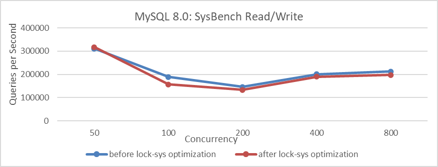
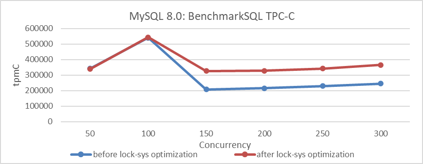

# The Significant Differences Between BenchmarkSQL and SysBench

Using the case of optimizing lock-sys as an example, this section evaluates the significant differences between the SysBench tool and BenchmarkSQL in MySQL performance testing [1].

First, use SysBench's standard read/write tests to evaluate the optimization of lock-sys.

Figure 5-21. Comparison of SysBench read-write tests before and after lock-sys optimization.

From the figure, it can be observed that after optimization, the overall performance of the SysBench tests has actually decreased.

Next, using BenchmarkSQL to test this optimization, the results are shown in the following figure.

Figure 5-22. Comparison of BenchmarkSQL tests before and after lock-sys optimization.

From the figure, it can be seen that the results of BenchmarkSQL's TPC-C test indicate that the lock-sys optimization is effective. Why does such a significant difference occur? Let's analyze the differences in characteristics between these testing tools to understand why their tests differ.

SysBench RW testing is characterized by its speed and simplicity with SQL queries. Under the same concurrency conditions, SysBench typically handles fewer concurrent transactions compared to BenchmarkSQL. Therefore, in the face of latch queue bottlenecks like lock-sys, high concurrency in SysBench may equate to low concurrency in BenchmarkSQL. Consequently, lock-sys optimizations may not have a significant impact in scenarios where BenchmarkSQL operates at lower concurrency levels.

BenchmarkSQL, a widely used TPC-C testing tool, distributes user threads more evenly across various modules, reducing susceptibility to aggregation effects. In high-concurrency situations, optimizing lock-sys can significantly reduce latch conflicts and minimize impact on other queues, thereby improving throughput. BenchmarkSQL's TPC-C testing is better suited for uncovering deeper concurrency problems in MySQL compared to SysBench.

This analysis uses deductive reasoning to explore the differences between SysBench and BenchmarkSQL. It demonstrates that poor performance in SysBench tests does not necessarily indicate poor performance in production environments, and vice versa. This discrepancy arises because SysBench test environments often differ significantly from real-world production environments. Consequently, SysBench test results should be used for scenario-specific performance comparisons rather than as comprehensive indicators of production capabilities.

It is worth noting that the main basis for performance testing and comparison in this book, mainly based on TPC-C, is as follows [2]:

*TPC benchmark C also known as TPC-C which is the leading online transaction processing (OLTP) benchmark has been used to perform the comparison.*

## References：

1. Bin Wang (2024). The Art of Problem-Solving in Software Engineering:How to Make MySQL Better.
2. R. N. Avula and C. Zou. Performance evaluation of TPC-C benchmark on various cloud providers, Proc. 11th IEEE Annu. Ubiquitous Comput. Electron. Mobile Commun. Conf. (UEMCON), pp. 226-233, Oct. 2020.