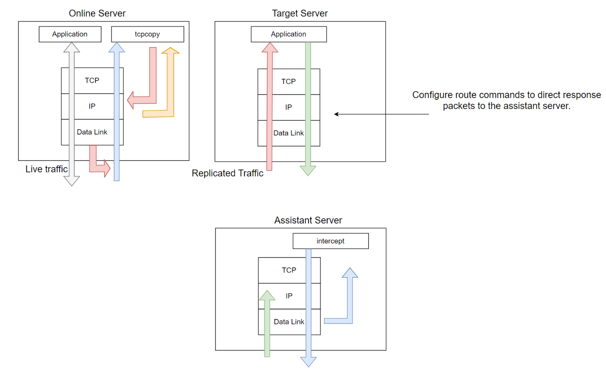

# 简述

随着互联网技术的迅速发展，服务端架构变得日益复杂，单靠开发或测试人员的个人经验已难以全面覆盖各种业务场景。因此，真实的线上流量对于服务端测试至关重要。TCPCopy是一款开源的流量回放工具，已广泛应用于多家大型企业。虽然许多人在项目中使用TCPCopy进行测试，但对其底层原理可能不甚了解。本文将简要介绍TCPCopy的工作原理，希望能为读者提供帮助。


# 架构

TCPCopy的架构经历了多次升级，本文介绍的是最新的1.0版本架构。正如下图所示，TCPCopy由两部分组成：*tcpcopy*和*intercept*。*tcpcopy*在线上服务器上运行，负责捕获在线TCP请求数据包，修改TCP/IP头部信息，并将其发送至测试服务器，巧妙地实现对测试服务器的“欺骗”。*intercept*在辅助服务器上运行，执行一些辅助任务，例如将响应信息传递回*tcpcopy*。



其简化的交互流程如下：

①. *tcpcopy*在线上服务器抓取数据包。

②. *tcpcopy*修改IP头和TCP头，伪造源IP和端口，并将数据包发送到测试服务器。伪造的IP地址依据启动时的*-x*和*-c*参数设置。

③. 测试服务器接收请求并返回响应包，响应包中的目的IP和端口为*tcpcopy*伪造的IP和端口。

④. 响应包被路由到*intercept*服务器，由*intercept*捕获并解析IP头和TCP头，通常只返回空响应数据给*tcpcopy*。

⑤. *tcpcopy*接收并处理返回数据。


# 技术原理

TCPCopy有在线和离线两种工作模式。在线模式主要用于实时捕获在线请求数据包，离线模式则从pcap格式文件中读取请求数据包。尽管工作方式不同，其核心原理相同。下文将从多个方面详细介绍TCPCopy的核心原理。

## **1. 抓包与发包**

*tcpcopy* 的核心功能可以简单概括为“抓包”和“发包”，那我们就从“抓包”开始谈起。如何捕获服务器的真实流量？许多人在刚接触这个问题时可能感到困惑。其实，Linux 操作系统已经提供了相关功能，只需掌握 Linux 高级网络编程的知识即可。*tcpcopy* 的抓包和发包代码都初始化在 `tcpcopy/src/communication/tc_socket.c` 文件中。接下来介绍 *tcpcopy* 抓发包的两种方式：


### Raw socket

Raw socket，即原始套接字，能够接收本机网卡上的数据包，对于监听和分析网络流量非常有用。*tcpcopy* 中用于初始化抓包的 raw socket 代码如下，这种方式支持数据链路层和 IP 层的抓包。

```c
int
tc_raw_socket_in_init(int type)
{
    int        fd, recv_buf_opt, ret;
    socklen_t  opt_len;

    if (type == COPY_FROM_LINK_LAYER) {
        /* copy ip datagram from Link layer */
        fd = socket(AF_PACKET, SOCK_DGRAM, htons(ETH_P_IP));
    } else {
        /* copy ip datagram from IP layer */
#if (TC_UDP)
        fd = socket(AF_INET, SOCK_RAW, IPPROTO_UDP);
#else
        fd = socket(AF_INET, SOCK_RAW, IPPROTO_TCP);
#endif
    }

    if (fd == -1) {
        tc_log_info(LOG_ERR, errno, "Create raw socket to input failed");   
        fprintf(stderr, "Create raw socket to input failed:%s\n", strerror(errno));
        return TC_INVALID_SOCK;
    }

    recv_buf_opt = 67108864;
    opt_len = sizeof(int);

    ret = setsockopt(fd, SOL_SOCKET, SO_RCVBUF, &recv_buf_opt, opt_len);
    if (ret == -1) {
        tc_log_info(LOG_ERR, errno, "Set raw socket(%d)'s recv buffer failed");
        tc_socket_close(fd);
        return TC_INVALID_SOCK;
    }

    return fd;
}
```

初始化发包的 raw socket 代码如下，首先创建IP层的 raw socket 套接字，并告知协议栈不再为IP层追加IP头。

```c
int
tc_raw_socket_out_init(void)
{
    int fd, n;

    n = 1;

    /*
     * On Linux when setting the protocol as IPPROTO_RAW,
     * then by default the kernel sets the IP_HDRINCL option and 
     * thus does not prepend its own IP header. 
     */
    fd = socket(AF_INET, SOCK_RAW, IPPROTO_RAW);

    if (fd == -1) {
        tc_log_info(LOG_ERR, errno, "Create raw socket to output failed");
        fprintf(stderr, "Create raw socket to output failed: %s\n", strerror(errno));
        return TC_INVALID_SOCK;
    } 

    /*
     * tell the IP layer not to prepend its own header.
     * It does not need setting for linux, but *BSD needs
     */
    if (setsockopt(fd, IPPROTO_IP, IP_HDRINCL, &n, sizeof(n)) < 0) {
        tc_socket_close(fd);
        tc_log_info(LOG_ERR, errno,
                    "Set raw socket(%d) option \"IP_HDRINCL\" failed", fd);
        return TC_INVALID_SOCK;
    }


    return fd;
}

```

构建完整的数据包并发送给目标服务器。

- `dst_addr` 填充目标IP地址
- IP头部填充源IP和目标IP等信息
- TCP头部填充源端口、目标端口等信息


### Pcap

Pcap 是操作系统提供的用于捕获网络流量的应用程序接口（API），名称源于“抓包”（packet capture）。在 Linux 系统中，pcap 通过 libpcap 实现，大多数流量抓取工具（如 *tcpdump* 等）也都是通过 libpcap 来进行抓包。

下面展示了初始化抓包 pcap 的代码。

```c
int
tc_pcap_socket_in_init(pcap_t **pd, char *device, 
        int snap_len, int buf_size, char *pcap_filter)
{
    int         fd;
    char        ebuf[PCAP_ERRBUF_SIZE]; 
    struct      bpf_program fp;
    bpf_u_int32 net, netmask;      

    if (device == NULL) {
        return TC_INVALID_SOCK;
    }

    tc_log_info(LOG_NOTICE, 0, "pcap open,device:%s", device);

    *ebuf = '\0';

    if (tc_pcap_open(pd, device, snap_len, buf_size) == TC_ERR) {
        return TC_INVALID_SOCK;
    }

    if (pcap_lookupnet(device, &net, &netmask, ebuf) < 0) {
        tc_log_info(LOG_WARN, 0, "lookupnet:%s", ebuf);
        return TC_INVALID_SOCK;
    }

    if (pcap_compile(*pd, &fp, pcap_filter, 0, netmask) == -1) {
        tc_log_info(LOG_ERR, 0, "couldn't parse filter %s: %s", 
                pcap_filter, pcap_geterr(*pd));
        return TC_INVALID_SOCK;
    }

    if (pcap_setfilter(*pd, &fp) == -1) {
        tc_log_info(LOG_ERR, 0, "couldn't install filter %s: %s",
                pcap_filter, pcap_geterr(*pd));
        pcap_freecode(&fp);
        return TC_INVALID_SOCK;
    }

    pcap_freecode(&fp);

    if (pcap_get_selectable_fd(*pd) == -1) {
        tc_log_info(LOG_ERR, 0, "pcap_get_selectable_fd fails"); 
        return TC_INVALID_SOCK;
    }

    if (pcap_setnonblock(*pd, 1, ebuf) == -1) {
        tc_log_info(LOG_ERR, 0, "pcap_setnonblock failed: %s", ebuf);
        return TC_INVALID_SOCK;
    }

    fd = pcap_get_selectable_fd(*pd);

    return fd;
}
```

初始化发包pcap的代码如下：

```
int
tc_pcap_snd_init(char *if_name, int mtu)
{
    char  pcap_errbuf[PCAP_ERRBUF_SIZE];

    pcap_errbuf[0] = '\0';
    pcap = pcap_open_live(if_name, mtu + sizeof(struct ethernet_hdr), 
            0, 0, pcap_errbuf);
    if (pcap_errbuf[0] != '\0') {
        tc_log_info(LOG_ERR, errno, "pcap open %s, failed:%s", 
                if_name, pcap_errbuf);
        fprintf(stderr, "pcap open %s, failed: %s, err:%s\n", 
                if_name, pcap_errbuf, strerror(errno));
        return TC_ERR;
    }

    return TC_OK;
}
```


### Raw socket VS. pcap

既然 *tcpcopy* 提供了两种抓发包方式，那么哪一种更好呢？

对于抓包，我们关注的仅仅是需要的包。如果抓包设置不当，系统内核可能会捕获过多的无关数据包，从而导致丢包现象，尤其是在高流量压力下更为明显。经过长时间的测试，发现利用 pcap 接口抓取请求数据包时，在线上环境中的丢包率通常高于使用 raw socket 的方式。因此，*tcpcopy* 默认使用 raw socket 进行抓包，尽管也可以选择使用 pcap 接口（通过 `--enable-pcap` 选项），这种方式主要适用于高端 pfring 抓包和交换机镜像后的抓包。

对于发包，*tcpcopy* 默认使用 raw socket 输出接口，也可以通过 *pcap_inject*（使用 `--enable-dlinject` 选项）来发包。具体选择哪种方式，可以根据实际环境中的性能测试结果来决定。


## **2. tcp协议栈**

我们知道 TCP 协议是有状态的协议。尽管上述介绍了发包的原理，但如果不建立真正的 TCP 连接，发送的包也无法被测试服务真正接收。在日常网络编程中，我们通常使用操作系统提供的封装好的 TCP socket 接口编程，无需过多关注 TCP 状态。然而，在 *tcpcopy* 中，由于需要修改数据包的源 IP 和目的 IP 以欺骗测试服务，操作系统提供的 API 已经无法满足需求。因此，*tcpcopy* 实现了一个模拟的 TCP 有效状态机，这也是 *tcpcopy* 源码中最复杂、最具挑战性的部分，具体代码位于 `tcpcopy/src/tcpcopy/tc_session.c` 文件中。


Figure 1. Classic TCP state machine overview.

在 *tcpcopy* 中，定义了一个 session 用于维护不同连接的信息。对不同的抓取数据包会做不同的处理：

- **SYN包**：表示新的连接请求。*tcpcopy* 会分配源 IP，修改目的 IP 和端口，然后将其发送到测试机。同时，新建一个 session 来保存此次会话中的所有状态。
- **ACK包**：
  - 纯 ACK 包：为了降低发包数量，一般不发送。
  - 带有 payload 的 ACK 包（表示具体请求）：找到对应的 session 并发送到测试机。如果本 session 正在等待上次请求的响应，则暂缓发送。
- **RST包**：如果当前 session 正在等待测试机的结果返回，则不发送 RST 包，否则发送。
- **FIN包**：如果当前 session 正在等待测试机的结果返回，则等待；否则发送 FIN 包。


## **3. 路由**

*tcpcopy* 发送请求数据包后，其路途可能不会是“一帆风顺”的：

- 请求数据包的 IP 是伪造的，而非 *tcpcopy* 所在机器的真实 IP。如果某些机器启用了 rpfilter（反向路径过滤技术），它会检查源 IP 地址是否可信。如果源 IP 不可信，数据包将在 IP 层被丢弃。
- 如果测试服务接收到了请求数据包，返回的数据包会被发送到伪造的 IP 地址。为了确保这些响应数据包不会错误地返回到伪造 IP 的客户端，需要正确配置路由。如果路由配置不正确，响应包将无法被 *intercept* 捕获，导致数据交互不完整。
- *intercept* 捕获到响应包后，会提取响应数据包，并丢弃具体数据，只返回响应头等必要信息给 *tcpcopy*。必要时，还会对返回信息进行合并，以减少对 *tcpcopy* 所在机器网络的影响。


## **4. Intercept**

刚开始接触 *tcpcopy* 的同学可能会感到困惑，既然有了 *tcpcopy*，为何还需要 *intercept* 呢？*intercept* 看似多余，但实际上扮演了重要角色。可以把 *intercept* 理解为 *tcpcopy* 的服务端，其名字本身就解释了它的作用：“拦截器”。那么，什么需要 *intercept* 来拦截呢？答案是测试服务的响应数据。

如果没有 *intercept*，测试服务的响应数据包将直接返回给 *tcpcopy*。由于 *tcpcopy* 部署在线上环境，这意味着测试服务的响应数据包会直接发送到线上服务器，极大地增加了线上服务器的网络负载，甚至可能影响在线服务的正常运行。有了 *intercept* 后，通过伪造源 IP，可以让测试服务“误以为”这些请求是发送给它的。*intercept* 还对返回的响应数据包信息进行了合并优化，进一步确保了网络层面线上环境不受测试环境的影响。

*intercept* 是一个独立进程，其默认使用 pcap 方式进行抓包。在启动时，需要传入 `-F` 参数，例如 “tcp and src port 8080”，以符合 libpcap 的过滤语法。这意味着 *intercept* 不直接与测试服务连接，而是监听指定端口，抓取测试服务的返回数据包，并与 *tcpcopy* 进行交互。

## **5. 性能**

*tcpcopy* 采用了单进程单线程架构，基于 epoll/select 事件驱动，其相关代码位于 `tcpcopy/src/event` 目录。默认情况下，编译时使用了 epoll，也可以通过 `--select` 选项切换到 select。可以根据测试结果的性能差异选择不同的方式。理论上，在连接数较多的情况下，epoll 的性能会更优。

在实际使用中，*tcpcopy* 的性能直接与流量大小以及 *intercept* 建立的连接数相关。单线程本身通常不会成为性能瓶颈（例如，nginx 和 redis 都采用了单线程 + epoll 的方式，并能处理大量并发）。由于 *tcpcopy* 仅与 *intercept* 直接建立连接，而不需要与测试机器建立连接或占用端口号，因此 *tcpcopy* 的资源消耗较少，主要体现在网络带宽的消耗上。

```
static tc_event_actions_t tc_event_actions = {
#ifdef TC_HAVE_EPOLL
    tc_epoll_create,
    tc_epoll_destroy,
    tc_epoll_add_event,
    tc_epoll_del_event,
    tc_epoll_polling
#else
    tc_select_create,
    tc_select_destroy,
    tc_select_add_event,
    tc_select_del_event,
    tc_select_polling
#endif
};
```


# 结语

TCPCopy是一款十分优秀的开源项目，但因为笔者能力有限，本文只介绍了TCPCopy的核心技术原理，很多细节并未涉及。不过还是希望通过本文的介绍，能够对TCPCopy和流量回放技术感兴趣的同学有所启发！

